<div align="center">

# 🧭 I Think, Therefore I Map

**Your Guide to SLAM (Simultaneous Localization and Mapping) in Robotic Systems**

[](#-paper-collection)
[](#-benchmarks--evaluation)
[](#-open-source-frameworks)
[](#-references)



</div>

---

## 📖 Table of Contents

- [Introduction](#-introduction)
- [What is SLAM?](#-what-is-slam)
- [Unified Taxonomy](#-unified-taxonomy)
  - [Sensors](#-sensors-what-perceives-the-world)
  - [Map Representations](#-map-representations-what-is-the-map-made-of)
  - [Pipeline](#-pipeline-how-does-slam-work)
- [Systems by Task & Strength](#-systems-by-task--strength)
  - [By Task](#-by-task-what-do-you-need-from-slam)
  - [By Strength](#-by-strength-what-is-each-system-best-at)
  - [System Profiles at a Glance](#-system-profiles-at-a-glance)
- [Paper Collection](#-paper-collection)
  - [Visual SLAM](#-visual-slam)
  - [Visual-Inertial Odometry & SLAM](#-visual-inertial-odometry--slam)
  - [LiDAR SLAM](#-lidar-slam)
  - [Learning-based SLAM](#-learning-based-slam)
  - [Neural Implicit SLAM](#-neural-implicit-slam)
  - [3D Gaussian Splatting SLAM](#-3d-gaussian-splatting-slam)
  - [Feed-Forward & Foundation Model SLAM](#-feed-forward--foundation-model-slam)
  - [Semantic & Open-Vocabulary SLAM](#-semantic--open-vocabulary-slam)
  - [SLAM with Memory](#-slam-with-memory)
  - [Dynamic SLAM](#-dynamic-slam)
  - [Multi-Robot & Collaborative SLAM](#-multi-robot--collaborative-slam)
  - [Place Recognition & Loop Closure](#-place-recognition--loop-closure)
  - [Back-End Optimization & Robust Estimation](#-back-end-optimization--robust-estimation)
  - [Radar & Event-based SLAM](#-radar--event-based-slam)
- [Benchmarks & Evaluation](#-benchmarks--evaluation)
  - [Datasets](#datasets)
  - [Metrics](#metrics)
  - [Memory & Long-Horizon Benchmarks](#memory--long-horizon-benchmarks)
  - [Evaluation Tools](#evaluation-tools)
- [Open-Source Frameworks](#-open-source-frameworks)
- [Applications](#-applications)
- [Future Directions](#-future-directions)
- [References](#-references)
- [Citation](#-citation)
- [Contributing](#-contributing)

---

## 🎯 Introduction

A robot that cannot answer **"Where am I?"** and **"What does the world around me look like?"** cannot do much else. **Simultaneous Localization and Mapping (SLAM)** is the problem of answering both questions at once: building a map of an unknown environment while estimating the robot's pose inside that map, using only onboard sensors.

SLAM is the cornerstone of autonomy. It is what lets a drone fly without GPS, a vacuum cleaner cover a whole apartment, a legged robot traverse a cave, and an AR headset pin a virtual object to a real table. In the era of embodied AI, the map is also becoming the robot's **spatial memory** — the structure that language models and policies query to reason about the physical world.

> 🧠 **Sister repository:** if a map is a robot's spatial memory, [MemoryIsAwesome](https://github.com/SuperMadee/MemoryIsAwesome) covers the rest of the memory story for foundation model agents.

### 📊 Repository Highlights

This repository collects robotic SLAM research, featuring:

- **350+ papers** spanning from foundational works (FastSLAM, 2002; MonoSLAM and PTAM, 2007) to recent feed-forward and Gaussian Splatting systems (2026)
- **Unified taxonomy** organizing research by Sensors × Representations × Pipeline
- **Task and strength guide** that maps jobs (odometry, dense mapping, semantic maps, multi-robot, …) to the systems best suited to them
- **30+ datasets, benchmarks, and evaluation tools** (KITTI, TUM RGB-D, EuRoC, Replica, Hilti, evo, etc.), with a metrics guide covering trajectory, mapping, rendering, place recognition, efficiency, and memory
- **20+ open-source frameworks and libraries** (GTSAM, g2o, Ceres, ORB-SLAM3, RTAB-Map, Cartographer, etc.)
- **20+ references** including surveys, textbooks, and courses that synthesize the field's evolution

### 🔬 Coverage Areas

| Category | Description | Key Topics |
|----------|-------------|------------|
| **📷 Visual SLAM** | Cameras as the primary sensor | Feature-based (ORB-SLAM), direct (DSO, LSD-SLAM), dense RGB-D (KinectFusion, ElasticFusion) |
| **🧲 Visual-Inertial** | Cameras tightly fused with IMUs | MSCKF, OKVIS, VINS-Mono, Basalt, OpenVINS, IMU preintegration |
| **🔦 LiDAR SLAM** | Range sensing for large-scale mapping | LOAM, LIO-SAM, FAST-LIO2, KISS-ICP, LiDAR-visual-inertial fusion |
| **🧠 Learning-based SLAM** | Learned odometry, depth, and matching | DROID-SLAM, DPVO, SuperPoint, LightGlue, TartanVO |
| **🌈 Neural Scene Representations** | Maps as neural fields or Gaussians | iMAP, NICE-SLAM, SplaTAM, MonoGS, Photo-SLAM |
| **🚀 Foundation Model SLAM** | Feed-forward 3D reconstruction priors | DUSt3R, MASt3R-SLAM, VGGT, CUT3R, MegaSaM |
| **💬 Semantic & Open-Vocabulary** | Maps that carry meaning | Kimera, Hydra, ConceptFusion, ConceptGraphs, 3D scene graphs |
| **💾 SLAM with Memory** | Maps as managed, long-term memory | RTAB-Map memory management, lifelong mapping, learned map memory, spatial memory for embodied agents |
| **🤖 Multi-Robot SLAM** | Shared maps across robot teams | Kimera-Multi, Swarm-SLAM, COVINS, DOOR-SLAM |

This repository synthesizes insights from surveys, textbooks, and tutorials on SLAM (see [References](#-references)).

---

## 🧩 What is SLAM?

### Conceptual Distinction

SLAM is distinct from related concepts:

| Concept | Description | Key Difference |
|---------|-------------|----------------|
| **Odometry (VO / LO / VIO)** | Incremental motion estimation from consecutive sensor frames | Locally accurate but drifts without bound; no loop closure or global map |
| **Localization** | Estimating pose inside a map that already exists | The map is given and fixed, not built online |
| **Mapping** | Building a map from sensor data with known poses | Assumes localization is already solved (e.g., by GPS or motion capture) |
| **Structure from Motion (SfM)** | Offline 3D reconstruction from unordered images | Batch processing with no real-time or causal constraint |
| **SLAM** | Online, joint estimation of trajectory and map | Real-time, incremental, and globally consistent through loop closure |

### The SLAM Problem in One Equation

Modern SLAM is formulated as **maximum a posteriori (MAP) estimation** over a factor graph. Given measurements $Z = \lbrace z_k \rbrace$, find the states $X$ (poses, landmarks, calibration) that best explain them:

```math
X^{\star} = \arg\max_{X} \; p(X \mid Z) = \arg\min_{X} \sum_{k} \lVert h_k(X_k) - z_k \rVert^{2}_{\Omega_k}
```

where $h_k$ is the measurement model of factor $k$ and $\Omega_k$ its information matrix. Almost every system in this repository is a choice of *which sensors produce* $z_k$, *what the map variables in* $X$ *look like*, and *how the minimization is carried out*.

### Three Ages of SLAM (and a Fourth)

| Era | Period | Focus |
|-----|--------|-------|
| **Classical Age** | 1986–2004 | Probabilistic formulations: EKF-SLAM, particle filters, maximum likelihood estimation |
| **Algorithmic-Analysis Age** | 2004–2015 | Observability, convergence, consistency; sparsity and efficient solvers (iSAM, g2o) |
| **Robust-Perception Age** | 2015–present | Robust performance, high-level understanding, resource awareness, task-driven perception |
| **Spatial AI Age** | 2020–present | Neural fields, Gaussian Splatting, feed-forward 3D foundation models, open-vocabulary maps |

The first three ages follow Cadena et al. (2016); the fourth reflects the shift this repository tracks most closely.

---

## 🧱 Unified Taxonomy

This repository organizes SLAM research through three unified lenses: **Sensors**, **Representations**, and **Pipeline**.

---

### 📡 Sensors (What Perceives the World?)

Sensors determine WHAT information is available to the system.

| Sensor | Measures | Strengths | Weaknesses |
|--------|----------|-----------|------------|
| **📷 Monocular Camera** | Bearing (appearance) | Cheap, light, rich texture | Scale ambiguity, sensitive to lighting and blur |
| **👀 Stereo / RGB-D** | Appearance + depth | Metric scale, dense geometry | Limited range (RGB-D), calibration-sensitive (stereo) |
| **🧲 IMU** | Acceleration, angular velocity | High rate, observes gravity and scale | Drifts quickly when used alone |
| **🔦 LiDAR** | Precise range | Accurate, long range, lighting-invariant | Cost, weight, degenerate in tunnels and open fields |
| **📻 Radar** | Range + Doppler velocity | Works in fog, dust, rain, smoke | Noisy, sparse, multipath |
| **⚡ Event Camera** | Per-pixel brightness changes | Microsecond latency, high dynamic range | No output when static, unconventional data |

#### 📷 Vision-centric

> 💡 **Why use it?** Cameras are inexpensive, lightweight, and information-dense. They capture the texture needed for place recognition, semantics, and photorealistic maps, which makes them the default choice for AR/VR devices, drones, and consumer robots.

#### 🔦 Range-centric

> 💡 **Why use it?** LiDAR measures geometry directly and is independent of ambient lighting. It gives centimeter-level accuracy at large scale, which is why it dominates autonomous driving, surveying, and field robotics.

#### 🧲 Multi-sensor Fusion

> 💡 **Why use it?** No single sensor works everywhere. Fusing complementary sensors (camera + IMU, LiDAR + IMU, LiDAR + camera + IMU) covers each one's failure modes and is the standard recipe for robust real-world deployment.

| Coupling | Description | Examples |
|----------|-------------|----------|
| **Loosely coupled** | Each sensor produces its own pose estimate; estimates are fused afterward | Early LOAM + IMU, EKF pose fusion |
| **Tightly coupled** | Raw measurements from all sensors are optimized jointly | VINS-Mono, LIO-SAM, FAST-LIO2, R3LIVE |

---

### 🧊 Map Representations (What Is the Map Made Of?)

Representations determine HOW the world is stored.

| Representation | Description | Characteristics |
|----------------|-------------|-----------------|
| **📍 Sparse** | 3D landmarks (points, lines, planes) with descriptors | Compact, efficient, accurate poses; not directly usable for planning |
| **🧱 Dense Geometric** | Point clouds, surfels, occupancy grids, TSDF voxels, meshes | Usable for planning and collision checking; memory-heavy |
| **🌈 Neural Implicit** | Scene encoded in MLP weights or feature grids (NeRF-style) | Continuous, hole-filling, compact; slow to optimize |
| **✨ 3D Gaussians** | Explicit anisotropic Gaussians rendered by splatting | Photorealistic, real-time rendering; large memory footprint |
| **💬 Semantic / Scene Graph** | Objects, rooms, and relations layered on top of geometry | Queryable by language and planners; depends on perception quality |

#### 📍 Sparse Maps

> 💡 **Why use it?** Sparse landmark maps keep the estimation problem small and well-conditioned. They give the most accurate trajectories per unit of compute and remain the backbone of production visual SLAM and VIO.

#### 🧱 Dense Geometric Maps

> 💡 **Why use it?** Robots need to know where free space and surfaces are. Dense maps directly support navigation, manipulation, and inspection, and they are simple to fuse incrementally.

| Type | Description | Use Case |
|------|-------------|----------|
| **Occupancy Grid / OctoMap** | Probabilistic free/occupied cells | 2D and 3D navigation |
| **TSDF / ESDF Voxels** | Signed distance to the nearest surface | Meshing, trajectory optimization |
| **Surfels** | Oriented discs fused over time | Deformable RGB-D and LiDAR mapping |
| **Point Clouds** | Raw or downsampled points | Large-scale LiDAR mapping, registration |

#### 🌈 Neural Implicit Maps and ✨ 3D Gaussians

> 💡 **Why use it?** Differentiable rendering turns the map itself into something that can be optimized against images. The result is photorealistic novel-view synthesis, plausible completion of unobserved regions, and a natural home for learned features.

#### 💬 Semantic Maps and Scene Graphs

> 💡 **Why use it?** Tasks are specified in terms of objects and places, not voxels. Semantic maps and hierarchical 3D scene graphs let planners and language models ask "where is the mug?" or "which room is the kitchen?".

---

### 🔄 Pipeline (How Does SLAM Work?)

The pipeline describes the operational lifecycle of a SLAM system.

<p align="center">
  
</p>

| Stage | Role | Description | Strategies |
|-------|------|-------------|------------|
| **Front-End (Tracking)** | Perceive | Turns raw sensor data into measurements and an initial pose | Feature matching, direct photometric alignment, ICP / scan matching, learned flow |
| **Back-End (Optimization)** | Infer | Estimates the trajectory and map that best fit all measurements | EKF / MSCKF filtering, sliding-window smoothing, bundle adjustment, pose graph optimization |
| **Loop Closure** | Recognize | Detects revisited places and corrects accumulated drift | Bag-of-words, global descriptors, geometric verification, robust outlier rejection |
| **Mapping** | Represent | Fuses observations into the chosen map representation | Keyframe maps, TSDF fusion, neural field or Gaussian optimization |

| Back-End Family | Idea | Trade-off |
|-----------------|------|-----------|
| **Filtering** | Marginalize past states, keep a current-state belief | Constant-time and lightweight; linearization errors are locked in |
| **Smoothing / Factor Graphs** | Optimize over many (or all) past states | More accurate through relinearization; needs sparsity and incremental solvers |
| **Learned / Differentiable** | Learn the update operator or embed the optimizer in a network | Strong priors and robustness; generalization and compute cost |

---

## 🏆 Systems by Task & Strength

The taxonomy above describes how SLAM systems are *built*. This section classifies them by what they are *for* and what they are *good at*, so you can go from a job to a shortlist. Every system named here has a full entry in the [Paper Collection](#-paper-collection).

> ℹ️ **How to read this.** Strengths reflect what each paper reports and how the system is commonly used in practice. They are not rankings from one unified benchmark, and results shift with sensor quality, calibration, and tuning. Always validate on your own data.

---

### 🧭 By Task (What Do You Need From SLAM?)

| Task | Output You Need | Representative Systems | Why These |
|------|-----------------|------------------------|-----------|
| **🎮 Odometry for control** | High-rate, low-latency pose; drift is acceptable | VINS-Mono, OpenVINS, Basalt, DM-VIO, FAST-LIO2, Point-LIO, KISS-ICP, DPVO | Light front-ends with no global optimization in the loop; proven on drones and legged robots |
| **🗺 Globally consistent SLAM** | Drift-free trajectory with loop closure and a reusable map | ORB-SLAM3, OKVIS2, VINS-Fusion, LIO-SAM, KISS-SLAM, RTAB-Map, Cartographer | Full pipelines: tracking, place recognition, and pose graph or bundle adjustment |
| **🏠 2D indoor navigation** | Occupancy grid for a wheeled robot | SLAM Toolbox, Cartographer, GMapping, Hector SLAM | Mature, CPU-only, and integrated with ROS navigation stacks |
| **🧱 Dense geometry for planning** | Occupancy, signed distance field, or mesh | Voxblox, nvblox, OctoMap, RTAB-Map, KinectFusion, PIN-SLAM, SHINE-Mapping | Maps that answer "is this space free?" and "how far is the nearest surface?" |
| **📸 Photorealistic mapping** | Renderable map for digital twins, AR, simulation | SplaTAM, MonoGS, Photo-SLAM, RTG-SLAM, FAST-LIVO2, R3LIVE, Gaussian-LIC, NICE-SLAM | Differentiable or colorized maps optimized for view synthesis as well as geometry |
| **📹 Uncalibrated or casual video** | Poses and dense geometry without intrinsics | MASt3R-SLAM, VGGT-SLAM, ViSTA-SLAM, MegaSaM, SLAM3R, CUT3R | Built on feed-forward 3D foundation models that carry their own geometric prior |
| **💬 Semantic & language-queryable maps** | Objects, rooms, and relations for task planning | Kimera, Hydra, Clio, ConceptGraphs, HOV-SG, ConceptFusion, VLMaps, DualMap | Attach labels or vision-language features to geometry; several build hierarchical scene graphs |
| **🏃 Dynamic scenes** | Robust poses or explicit object motion when things move | DynaSLAM, DynoSAM, VDO-SLAM, Khronos, WildGS-SLAM, MonST3R, Pi3MOS-SLAM, ERASOR | Either mask out dynamics, or estimate object motion jointly with the camera |
| **🤝 Multi-robot mapping** | One shared map across a team | Kimera-Multi, Swarm-SLAM, DOOR-SLAM, COVINS, DCL-SLAM, D²SLAM, maplab 2.0 | Inter-robot loop closure, outlier rejection, and communication-aware optimization |
| **📍 Relocalization & map reuse** | Localize again in a previously built map | ORB-SLAM3, maplab, HF-Net (hloc), DBoW2, AnyLoc, Scan Context, STD | Place recognition plus geometric verification; multi-session map management |
| **💾 Long-term operation & memory** | A map that stays bounded, current, and queryable over weeks | RTAB-Map, LT-mapper, ELite, Khronos, DynaMem, ReMEmbR, 3D-Mem, Embodied-RAG | Explicit memory management, change handling, and retrieval; see [SLAM with Memory](#-slam-with-memory) |
| **🌫 Degraded sensing** | Estimation in dark, fog, dust, smoke, or at very high speed | Super Odometry, LVI-SAM, LOCUS 2.0, RadarSLAM, CFEAR Radarodometry, Ultimate SLAM, DEVO | Redundant sensors or modalities (radar, events) that survive when cameras and LiDAR fail |

---

### 💪 By Strength (What Is Each System Best At?)

| Strength | Systems That Stand Out | Typical Trade-off |
|----------|------------------------|-------------------|
| **🎯 Trajectory accuracy** | ORB-SLAM3, DM-VIO, OKVIS2, DROID-SLAM, FAST-LIO2, CT-ICP | Needs good calibration and, for learned methods, a GPU |
| **⚡ Speed & low compute** | SVO, OpenVINS, S-MSCKF, KISS-ICP, FAST-LIO2, Faster-LIO, XFeat | Sparse or point-cloud maps; little or no global optimization |
| **🧩 Works out of the box** | KISS-ICP, KISS-SLAM, MAD-ICP, GenZ-ICP, RKO-LIO | Gives up some per-sensor tuning headroom for generality |
| **🌀 Aggressive motion** | Point-LIO, FAST-LIO2, DLIO, VINS-Mono, Ultimate SLAM | Relies on a well-synchronized IMU or an event camera |
| **🧊 Low-texture or repetitive scenes** | DSO, LSD-SLAM, PL-SLAM, AirSLAM, LiDAR-based systems | Direct methods are sensitive to exposure changes and rolling shutter |
| **🚧 Geometric degeneracy (corridors, tunnels, open fields)** | GenZ-ICP, LVI-SAM, Super Odometry, FAST-LIVO2, BIEVR-LIO | Extra sensors and more complex calibration |
| **💡 Lighting & appearance change** | AirSLAM, DXSLAM, SuperPoint + LightGlue pipelines, AnyLoc, LiDAR-based systems | Learned features add GPU cost |
| **🌍 Large scale & long-term operation** | RTAB-Map, Cartographer, maplab, LIO-SAM, VGGT-Long, VINGS-Mono | Memory management and loop closure become the bottleneck |
| **🖼 Rendering quality** | SplaTAM, MonoGS, Photo-SLAM, Splat-SLAM, HI-SLAM2 | GPU required; map size grows quickly |
| **🕳 Completeness (filling unobserved regions)** | iMAP, NICE-SLAM, Co-SLAM, ESLAM | Slow optimization; hard to correct after loop closure |
| **🛡 Outlier robustness** | Graduated Non-Convexity, TEASER++, KISS-Matcher, DOOR-SLAM, Kimera-Multi | More computation in the back-end |
| **🎲 Zero-shot generalization** | DROID-SLAM, DPVO, TartanVO, MASt3R-SLAM, VGGT-SLAM | GPU memory; metric scale not always available |
| **🔧 No calibration needed** | MASt3R-SLAM, VGGT-SLAM, ViSTA-SLAM, MegaSaM, CalfVO | Lower precision than a well-calibrated classical pipeline |
| **🧠 Scene understanding** | Hydra, Clio, ConceptGraphs, HOV-SG, Khronos | Depends on upstream segmentation and vision-language models |
| **📜 Certifiable correctness** | SE-Sync, TEASER++, DPGO | Applies to specific problem classes (pose graphs, registration) |

---

### 🪪 System Profiles at a Glance

A side-by-side view of widely used systems, one per design family.

| System | Sensors | Primary Task | Map | Loop Closure | Compute | Standout Strength |
|--------|---------|--------------|-----|--------------|---------|-------------------|
| **ORB-SLAM3** | Mono / stereo / RGB-D, optional IMU | Full SLAM | Sparse landmarks | ✅ | CPU | Accuracy and multi-session map reuse |
| **VINS-Fusion** | Mono / stereo + IMU, optional GPS | VIO + global fusion | Sparse landmarks | ✅ | CPU | Robust initialization, GPS fusion |
| **OpenVINS** | Mono / stereo + IMU | Odometry | Sparse (sliding window) | ➖ | CPU | Lightweight, consistent filter |
| **DROID-SLAM** | Mono / stereo / RGB-D | Dense learned SLAM | Per-keyframe dense depth | Global BA | GPU | Robustness across datasets |
| **DPVO** | Mono | Learned odometry | Sparse patches | ➖ (DPV-SLAM adds it) | GPU | DROID-level accuracy at lower cost |
| **KISS-ICP** | LiDAR | Odometry | Voxelized points | ➖ (KISS-SLAM adds it) | CPU | Near-zero tuning |
| **FAST-LIO2** | LiDAR + IMU | Odometry | Point cloud (ikd-Tree) | ➖ | CPU | Speed and fast-motion robustness |
| **LIO-SAM** | LiDAR + IMU, optional GPS | Full SLAM | Point cloud keyframes | ✅ | CPU | Extensible factor graph |
| **FAST-LIVO2** | LiDAR + IMU + camera | Odometry + colored mapping | Unified voxel map | ➖ | CPU | Dense colored maps onboard |
| **Cartographer** | 2D / 3D LiDAR, optional IMU | Full SLAM | Submap grids | ✅ | CPU | Real-time loop closure indoors |
| **RTAB-Map** | RGB-D / stereo / LiDAR | Full SLAM | Occupancy grid, point cloud | ✅ | CPU | Long-term, multi-session operation |
| **Hydra** | Stereo / RGB-D + IMU | Metric-semantic SLAM | Mesh + 3D scene graph | ✅ | CPU + GPU for segmentation | Hierarchical scene understanding |
| **NICE-SLAM** | RGB-D | Dense neural SLAM | Feature grids + decoders | ➖ | GPU | Hole-filling, continuous geometry |
| **SplaTAM** | RGB-D | Dense Gaussian SLAM | 3D Gaussians | ➖ | GPU | Rendering quality |
| **Photo-SLAM** | Mono / stereo / RGB-D | Photorealistic SLAM | Hyper primitives (ORB + Gaussians) | ✅ | GPU, incl. embedded | Real-time photorealistic mapping |
| **MASt3R-SLAM** | Mono, uncalibrated | Dense feed-forward SLAM | Fused pointmaps | ✅ | GPU | Works without camera intrinsics |
| **VGGT-SLAM** | Mono, uncalibrated | Dense feed-forward SLAM | Aligned submaps | ✅ | GPU | Handles projective ambiguity |
| **ConceptGraphs** | Posed RGB-D | Open-vocabulary mapping | Object-level 3D scene graph | n/a (uses external poses) | GPU | Language-queryable objects and relations |
| **Swarm-SLAM** | LiDAR / stereo / RGB-D, multi-robot | Collaborative SLAM | Per-robot pose graphs | ✅ inter-robot | CPU | Decentralized, sparse communication |

✅ built in · ➖ not included (pair with a loop-closure module from [Place Recognition & Loop Closure](#-place-recognition--loop-closure))

---

## 📚 Paper Collection

> 🔗 **About the links.** Each entry links to the published version (conference or journal) and is labeled with its venue. `[[arXiv]]` is used only when no published version was found. **Year** is the year of that published version, or the arXiv year for preprints.

### 📷 Visual SLAM

> **Visual SLAM** estimates camera motion and scene structure from images alone. It answers "where am I?" using the cheapest and most information-rich sensor available, and it is the lineage from which most modern SLAM ideas (keyframes, bundle adjustment, bag-of-words loop closure) emerged.

#### 📍 **Feature-based Visual SLAM**

> **Feature-based (indirect) methods** extract and match sparse keypoints, then minimize *reprojection error*. They are robust to photometric changes and large baselines, and remain the reference for trajectory accuracy.

| Paper | Year | Description | Links |
|-------|------|-------------|-------|
| MonoSLAM | 2007 | First real-time single-camera SLAM, maintaining a sparse landmark map with an EKF and active feature search at 30 Hz. | [[TPAMI]](https://doi.org/10.1109/TPAMI.2007.1049) |
| PTAM | 2007 | Splits tracking and mapping into parallel threads and introduces keyframe-based bundle adjustment, the template for most later visual SLAM systems. | [[ISMAR]](https://doi.org/10.1109/ISMAR.2007.4538852) |
| ORB-SLAM | 2015 | Complete monocular SLAM using ORB features for tracking, mapping, relocalization, and loop closing, with a covisibility graph and essential graph for scalability. | [[T-RO]](https://doi.org/10.1109/TRO.2015.2463671) [[GitHub]](https://github.com/raulmur/ORB_SLAM) |
| ORB-SLAM2 | 2017 | Extends ORB-SLAM to stereo and RGB-D cameras with metric scale, map reuse, and a lightweight localization mode. | [[T-RO]](https://doi.org/10.1109/TRO.2017.2705103) [[GitHub]](https://github.com/raulmur/ORB_SLAM2) |
| PL-SLAM | 2019 | Stereo SLAM that combines point and line segment features to stay robust in low-texture, man-made environments. | [[T-RO]](https://doi.org/10.1109/TRO.2019.2899783) [[GitHub]](https://github.com/rubengooj/pl-slam) |
| OpenVSLAM | 2019 | Modular, well-engineered indirect visual SLAM framework supporting perspective, fisheye, and equirectangular cameras. | [[ACM MM]](https://doi.org/10.1145/3343031.3350539) [[GitHub]](https://github.com/stella-cv/stella_vslam) |
| GCNv2 | 2019 | Learns binary keypoint descriptors with a CNN designed as a drop-in replacement for ORB inside ORB-SLAM2, running in real time on embedded GPUs. | [[RA-L]](https://doi.org/10.1109/LRA.2019.2927954) [[GitHub]](https://github.com/jiexiong2016/GCNv2_SLAM) |
| UcoSLAM | 2020 | Fuses natural keypoints with fiducial squared markers so that scale and long-term relocalization come for free when markers are present. | [[Pattern Recognition]](https://doi.org/10.1016/j.patcog.2019.107193) |
| DXSLAM | 2020 | Replaces hand-crafted features with deep local and global CNN features for more robust tracking, relocalization, and loop closure. | [[IROS]](https://doi.org/10.1109/IROS45743.2020.9340907) [[GitHub]](https://github.com/ivipsourcecode/dxslam) |
| ORB-SLAM3 | 2021 | Adds tightly coupled visual-inertial SLAM based on MAP estimation and a multi-map (Atlas) system, supporting pinhole and fisheye cameras. | [[T-RO]](https://doi.org/10.1109/TRO.2021.3075644) [[GitHub]](https://github.com/UZ-SLAMLab/ORB_SLAM3) |
| OV²SLAM | 2021 | Fully online, versatile visual SLAM with optical-flow tracking and an online bag-of-words for loop closure, built for real-time robotics use. | [[RA-L]](https://doi.org/10.1109/LRA.2021.3058069) [[GitHub]](https://github.com/ov2slam/ov2slam) |
| AirSLAM | 2025 | Point-line visual SLAM built on learned features and a unified point-line extraction network, designed for illumination robustness and embedded deployment. | [[T-RO]](https://doi.org/10.1109/TRO.2025.3539171) [[GitHub]](https://github.com/sair-lab/AirSLAM) |

#### 🎞 **Direct & Semi-Direct Visual SLAM**

> **Direct methods** skip feature extraction and minimize *photometric error* on raw pixel intensities. They use more of the image, work in low-texture scenes, and produce semi-dense or dense reconstructions.

| Paper | Year | Description | Links |
|-------|------|-------------|-------|
| DTAM | 2011 | Dense tracking and mapping in real time: builds per-pixel depth maps from a cost volume and tracks by whole-image alignment against the dense model. | [[ICCV]](https://doi.org/10.1109/ICCV.2011.6126513) |
| LSD-SLAM | 2014 | Large-scale direct monocular SLAM with semi-dense depth maps and Sim(3) pose graph optimization to handle scale drift. | [[ECCV]](https://doi.org/10.1007/978-3-319-10605-2_54) [[GitHub]](https://github.com/tum-vision/lsd_slam) |
| SVO | 2014 | Semi-direct visual odometry that tracks by sparse image alignment and maps with depth filters, running at hundreds of frames per second on MAVs. | [[ICRA]](https://doi.org/10.1109/ICRA.2014.6906584) [[GitHub]](https://github.com/uzh-rpg/rpg_svo) |
| Stereo DSO | 2017 | Brings static stereo into DSO's windowed bundle adjustment for metric scale and better large-scale accuracy. | [[ICCV]](https://doi.org/10.1109/ICCV.2017.421) |
| DSO | 2018 | Direct sparse odometry with joint optimization of poses, inverse depths, and affine brightness, plus full photometric calibration. | [[TPAMI]](https://doi.org/10.1109/TPAMI.2017.2658577) [[GitHub]](https://github.com/JakobEngel/dso) |
| LDSO | 2018 | Adds loop closure to DSO by favoring repeatable corner features and running Sim(3) pose graph optimization. | [[IROS]](https://doi.org/10.1109/IROS.2018.8593376) [[GitHub]](https://github.com/tum-vision/LDSO) |
| DSM | 2020 | Direct sparse mapping: a fully direct monocular SLAM that reuses map points through a persistent covisibility-based map. | [[T-RO]](https://doi.org/10.1109/TRO.2020.2991614) [[GitHub]](https://github.com/jzubizarreta/dsm) |

#### 🧱 **Dense RGB-D SLAM & Volumetric Mapping**

> **Dense RGB-D SLAM** fuses depth images into a single surface model (TSDF volume or surfels) and tracks the camera against it. These systems introduced real-time dense reconstruction and remain the geometric baseline for neural methods.

| Paper | Year | Description | Links |
|-------|------|-------------|-------|
| KinectFusion | 2011 | Real-time dense surface mapping and tracking by fusing depth frames into a TSDF volume and aligning with frame-to-model ICP on a GPU. | [[ISMAR]](https://doi.org/10.1109/ISMAR.2011.6092378) |
| OctoMap | 2013 | Probabilistic 3D occupancy mapping in an octree, modelling free, occupied, and unknown space with multi-resolution queries. | [[AURO]](https://doi.org/10.1007/s10514-012-9321-0) [[GitHub]](https://github.com/OctoMap/octomap) |
| DVO-SLAM | 2013 | Dense visual odometry combining photometric and depth error with keyframe-based pose graph SLAM for RGB-D cameras. | [[GitHub]](https://github.com/tum-vision/dvo_slam) |
| ElasticFusion | 2015 | Surfel-based dense RGB-D SLAM that stays globally consistent through non-rigid map deformation instead of a pose graph. | [[RSS]](https://doi.org/10.15607/RSS.2015.XI.001) [[GitHub]](https://github.com/mp3guy/ElasticFusion) |
| InfiniTAM v3 | 2017 | Efficient large-scale volumetric fusion framework with voxel hashing, submaps, loop closure, and relocalization. | [[arXiv]](https://arxiv.org/abs/1708.00783) [[GitHub]](https://github.com/victorprad/InfiniTAM) |
| BundleFusion | 2017 | Globally consistent real-time 3D reconstruction with hierarchical bundle adjustment and on-the-fly surface re-integration. | [[TOG]](https://doi.org/10.1145/3054739) [[GitHub]](https://github.com/niessner/BundleFusion) |
| Voxblox | 2017 | Incrementally builds Euclidean signed distance fields from TSDFs on a CPU for online MAV planning. | [[IROS]](https://doi.org/10.1109/IROS.2017.8202315) [[GitHub]](https://github.com/ethz-asl/voxblox) |
| BAD SLAM | 2019 | Real-time direct bundle adjustment for RGB-D SLAM that jointly optimizes surfels and camera poses, released with the ETH3D SLAM benchmark. | [[GitHub]](https://github.com/ETH3D/badslam) |
| RTAB-Map | 2019 | Long-term, large-scale graph SLAM library for RGB-D, stereo, and LiDAR with appearance-based loop closure and memory management. | [[JFR]](https://doi.org/10.1002/rob.21831) [[GitHub]](https://github.com/introlab/rtabmap) |
| nvblox | 2024 | GPU-accelerated incremental signed distance field mapping aimed at real-time navigation on embedded platforms. | [[ICRA]](https://doi.org/10.1109/ICRA57147.2024.10611532) [[GitHub]](https://github.com/nvidia-isaac/nvblox) |

---

### 🧲 Visual-Inertial Odometry & SLAM

> **Visual-inertial** systems fuse cameras with an IMU. The IMU makes scale and gravity observable and bridges fast motion or texture-less frames; the camera bounds the IMU's drift. This pairing is the default state estimator for drones, phones, and AR/VR headsets.

| Paper | Year | Description | Links |
|-------|------|-------------|-------|
| MSCKF | 2007 | Multi-state constraint Kalman filter that uses feature tracks as constraints across a sliding window of camera poses without keeping landmarks in the state. | [[ICRA]](https://doi.org/10.1109/ROBOT.2007.364024) |
| OKVIS | 2015 | Keyframe-based visual-inertial odometry using sliding-window nonlinear optimization with marginalization. | [[IJRR]](https://doi.org/10.1177/0278364914554813) [[GitHub]](https://github.com/ethz-asl/okvis) |
| ROVIO | 2015 | Robust direct EKF-based visual-inertial odometry that uses photometric patch errors as the filter innovation. | [[IROS]](https://doi.org/10.1109/IROS.2015.7353389) [[GitHub]](https://github.com/ethz-asl/rovio) |
| On-Manifold Preintegration | 2017 | Derives IMU preintegration on the SO(3) manifold with analytic Jacobians and bias correction, enabling efficient real-time visual-inertial smoothing. | [[T-RO]](https://doi.org/10.1109/TRO.2016.2597321) |
| VI-ORB-SLAM | 2017 | Visual-inertial monocular SLAM with map reuse and a dedicated IMU initialization procedure, a precursor of ORB-SLAM3. | [[RA-L]](https://doi.org/10.1109/LRA.2017.2653359) |
| VINS-Mono | 2018 | Robust monocular visual-inertial state estimator with online initialization, relocalization, loop closure, and 4-DoF pose graph optimization. | [[T-RO]](https://doi.org/10.1109/TRO.2018.2853729) [[GitHub]](https://github.com/HKUST-Aerial-Robotics/VINS-Mono) |
| S-MSCKF | 2018 | Stereo MSCKF for fast autonomous flight, showing filter-based VIO that is accurate and light enough for aggressive MAV maneuvers. | [[RA-L]](https://doi.org/10.1109/LRA.2018.2793349) [[GitHub]](https://github.com/KumarRobotics/msckf_vio) |
| VI-DSO | 2018 | Direct sparse visual-inertial odometry with dynamic marginalization, jointly optimizing photometric and inertial energy. | [[ICRA]](https://doi.org/10.1109/ICRA.2018.8462905) |
| R-VIO | 2018 | Robocentric visual-inertial odometry that formulates the filter in a moving local frame to improve consistency. | [[IROS]](https://doi.org/10.1109/IROS.2018.8593643) [[GitHub]](https://github.com/rpng/R-VIO) |
| VINS-Fusion | 2019 | General optimization-based framework for fusing local sensors (mono/stereo cameras, IMU) with global sensors such as GPS. | [[arXiv]](https://arxiv.org/abs/1901.03638) [[GitHub]](https://github.com/HKUST-Aerial-Robotics/VINS-Fusion) |
| Kimera | 2020 | Open-source library for real-time metric-semantic SLAM: VIO, robust pose graph optimization, meshing, and 3D semantic reconstruction. | [[ICRA]](https://doi.org/10.1109/ICRA40945.2020.9196885) [[GitHub]](https://github.com/MIT-SPARK/Kimera) |
| Basalt | 2020 | Visual-inertial mapping with nonlinear factor recovery, compressing VIO information into factors usable in global bundle adjustment. | [[RA-L]](https://doi.org/10.1109/LRA.2019.2961227) [[GitLab]](https://gitlab.com/VladyslavUsenko/basalt) |
| OpenVINS | 2020 | Research platform for filter-based visual-inertial estimation with an on-manifold sliding-window EKF, online calibration, and extensive documentation. | [[ICRA]](https://doi.org/10.1109/ICRA40945.2020.9196524) [[GitHub]](https://github.com/rpng/open_vins) |
| TLIO | 2020 | Tight learned inertial odometry: a network regresses displacement and uncertainty from IMU alone, fused in an EKF for pedestrian tracking. | [[RA-L]](https://doi.org/10.1109/LRA.2020.3007421) |
| DM-VIO | 2022 | Delayed marginalization keeps a second factor graph alive so the visual prior can be relinearized after IMU initialization, yielding highly accurate monocular VIO. | [[RA-L]](https://doi.org/10.1109/LRA.2021.3140129) [[GitHub]](https://github.com/lukasvst/dm-vio) |
| OKVIS2 | 2022 | Extends OKVIS to full visual-inertial SLAM with pose-graph edges from marginalized observations and loop closure in real time. | [[arXiv]](https://arxiv.org/abs/2202.09199) [[GitHub]](https://github.com/smartroboticslab/okvis2) |
| DBA-Fusion | 2024 | Tightly integrates DROID-style dense bundle adjustment with IMU and GNSS in a factor graph for large-scale localization and dense mapping. | [[RA-L]](https://doi.org/10.1109/LRA.2024.3400156) [[GitHub]](https://github.com/GREAT-WHU/DBA-Fusion) |
| cuVSLAM | 2025 | CUDA-accelerated visual odometry and SLAM supporting 1 to 32 cameras with an optional IMU, running in real time on Jetson edge devices. | [[arXiv]](https://arxiv.org/abs/2506.04359) [[GitHub]](https://github.com/nvidia-isaac/cuVSLAM) |
| OKVIS2-X | 2025 | Multi-sensor SLAM fusing visual, inertial, depth or LiDAR, and GNSS measurements while building dense volumetric occupancy submaps in real time. | [[T-RO]](https://doi.org/10.1109/TRO.2025.3619051) |
| FF-VIO-Init | 2026 | Feature-free monocular VIO initialization using point clouds from a feed-forward 3D model, reducing the problem to scale, velocity, and gravity estimation. | [[RSS]](https://www.roboticsproceedings.org/rss22/p047.html) [[GitHub]](https://github.com/Yuantai-Z/FF-VIO-Init) |

---

### 🔦 LiDAR SLAM

> **LiDAR SLAM** registers range scans to estimate motion and build geometrically precise maps. It is insensitive to lighting, scales to kilometers, and is the workhorse of autonomous driving, surveying, and subterranean exploration.

#### 🗺 **2D LiDAR & Classical SLAM**

> **2D laser SLAM** powers most indoor mobile robots. These methods established occupancy grids, particle filters, and graph-based scan matching as standard tools.

| Paper | Year | Description | Links |
|-------|------|-------------|-------|
| FastSLAM | 2002 | Factors the SLAM posterior into a particle filter over trajectories and independent per-landmark EKFs, scaling to very large landmark maps. | [[AAAI]](https://aaai.org/papers/00593-aaai02-089-fastslam-a-factored-solution-to-the-simultaneous-localization-and-mapping-problem/) |
| GMapping | 2007 | Rao-Blackwellized particle filter grid mapping with improved proposal distributions and adaptive resampling. | [[T-RO]](https://doi.org/10.1109/TRO.2006.889486) |
| Hector SLAM | 2011 | Fast 2D scan matching on multi-resolution occupancy grids without odometry, designed for search-and-rescue robots. | [[SSRR]](https://doi.org/10.1109/SSRR.2011.6106777) [[GitHub]](https://github.com/tu-darmstadt-ros-pkg/hector_slam) |
| Cartographer | 2016 | Real-time loop closure in 2D LiDAR SLAM using submaps and a branch-and-bound scan matcher, later extended to 3D. | [[ICRA]](https://doi.org/10.1109/ICRA.2016.7487258) [[GitHub]](https://github.com/cartographer-project/cartographer) |
| SLAM Toolbox | 2021 | Production-grade 2D SLAM for ROS 2 with lifelong mapping, map serialization, and localization modes; the default SLAM in Nav2. | [[JOSS]](https://doi.org/10.21105/joss.02783) [[GitHub]](https://github.com/SteveMacenski/slam_toolbox) |

#### 🔦 **3D LiDAR Odometry & Mapping**

> **3D LiDAR odometry** aligns point clouds using feature-based (edge/plane) or direct (ICP-style) registration, often with motion compensation for the continuously spinning sensor.

| Paper | Year | Description | Links |
|-------|------|-------------|-------|
| LOAM | 2014 | Splits the problem into high-rate odometry and low-rate mapping using edge and planar features, defining the dominant LiDAR SLAM paradigm. | [[RSS]](https://doi.org/10.15607/RSS.2014.X.007) |
| LeGO-LOAM | 2018 | Lightweight, ground-optimized LOAM with point cloud segmentation and two-step optimization for embedded ground vehicles. | [[IROS]](https://doi.org/10.1109/IROS.2018.8594299) [[GitHub]](https://github.com/RobustFieldAutonomyLab/LeGO-LOAM) |
| SuMa | 2018 | Surfel-based LiDAR mapping with projective data association and map-based loop closure verification. | [[RSS]](https://doi.org/10.15607/RSS.2018.XIV.016) [[GitHub]](https://github.com/jbehley/SuMa) |
| LO-Net | 2019 | End-to-end deep LiDAR odometry that learns features, normals, and dynamic masks, coupled with a mapping module. | [[CVPR]](https://doi.org/10.1109/CVPR.2019.00867) |
| SuMa++ | 2019 | Adds semantic segmentation to surfel maps to filter moving objects and constrain data association with semantic labels. | [[GitHub]](https://github.com/PRBonn/semantic_suma) |
| HDL Graph SLAM | 2019 | Open-source 3D LiDAR graph SLAM using NDT scan matching with GPS, IMU, and floor-plane constraints. | [[GitHub]](https://github.com/koide3/hdl_graph_slam) |
| LOAM-Livox | 2020 | Adapts LOAM to solid-state LiDARs with small fields of view and irregular scan patterns. | [[ICRA]](https://doi.org/10.1109/ICRA40945.2020.9197440) [[GitHub]](https://github.com/hku-mars/loam_livox) |
| BALM | 2021 | Formulates LiDAR bundle adjustment on edge and plane features with features eliminated in closed form, enabling local-window map refinement. | [[RA-L]](https://doi.org/10.1109/LRA.2021.3062815) [[GitHub]](https://github.com/hku-mars/BALM) |
| F-LOAM | 2021 | Fast LOAM with a non-iterative two-stage distortion compensation for lower computational cost. | [[IROS]](https://doi.org/10.1109/IROS51168.2021.9636655) [[GitHub]](https://github.com/wh200720041/floam) |
| MULLS | 2021 | Versatile LiDAR SLAM based on multi-metric linear least squares over ground, facade, pillar, and beam feature points. | [[ICRA]](https://doi.org/10.1109/ICRA48506.2021.9561364) [[GitHub]](https://github.com/YuePanEdward/MULLS) |
| VoxelMap | 2022 | Adaptive probabilistic voxel map where each voxel holds a plane with uncertainty, improving LiDAR odometry accuracy and efficiency. | [[RA-L]](https://doi.org/10.1109/LRA.2022.3187250) [[GitHub]](https://github.com/hku-mars/VoxelMap) |
| CT-ICP | 2022 | Continuous-time ICP that is elastic within a scan but allows discontinuity between scans, robust to high-frequency motion. | [[ICRA]](https://doi.org/10.1109/ICRA46639.2022.9811849) [[GitHub]](https://github.com/jedeschaud/ct_icp) |
| DLO | 2022 | Direct LiDAR odometry on dense point clouds with a fast keyframe-based submapping strategy for computationally limited robots. | [[RA-L]](https://doi.org/10.1109/LRA.2022.3142739) [[GitHub]](https://github.com/vectr-ucla/direct_lidar_odometry) |
| KISS-ICP | 2023 | Shows that carefully done point-to-point ICP with adaptive thresholding and a simple voxel map matches complex systems with almost no tuning. | [[RA-L]](https://doi.org/10.1109/LRA.2023.3236571) [[GitHub]](https://github.com/PRBonn/kiss-icp) |
| SHINE-Mapping | 2023 | Large-scale 3D mapping using sparse hierarchical implicit neural representations learned from LiDAR. | [[ICRA]](https://doi.org/10.1109/ICRA48891.2023.10160907) [[GitHub]](https://github.com/PRBonn/SHINE_mapping) |
| NeRF-LOAM | 2023 | Neural implicit representation for large-scale incremental LiDAR odometry and mapping, jointly optimizing poses and an SDF. | [[ICCV]](https://doi.org/10.1109/ICCV51070.2023.00755) [[GitHub]](https://github.com/JunyuanDeng/NeRF-LOAM) |
| PIN-SLAM | 2024 | LiDAR SLAM using a point-based implicit neural map that is elastic under loop closure, giving globally consistent neural SDF maps. | [[T-RO]](https://doi.org/10.1109/TRO.2024.3422055) [[GitHub]](https://github.com/PRBonn/PIN_SLAM) |
| MAD-ICP | 2024 | LiDAR odometry based on a kd-tree forest and PCA-driven data matching that works out of the box across sensors. | [[RA-L]](https://doi.org/10.1109/LRA.2024.3456509) [[GitHub]](https://github.com/rvp-group/mad-icp) |
| GenZ-ICP | 2025 | Adaptively weights point-to-plane and point-to-point errors to stay robust in geometrically degenerate environments such as corridors. | [[RA-L]](https://doi.org/10.1109/LRA.2024.3498779) [[GitHub]](https://github.com/cocel-postech/genz-icp) |
| KISS-SLAM | 2025 | Extends the KISS philosophy to full LiDAR SLAM with local maps, loop closing, and pose graph optimization using minimal parameters. | [[GitHub]](https://github.com/PRBonn/kiss-slam) |

#### 🧲 **LiDAR-Inertial Odometry**

> **LiDAR-inertial** fusion uses the IMU to de-skew scans and survive aggressive motion, and the LiDAR to bound inertial drift. Tightly coupled LIO is now the default for handheld, legged, and aerial mapping.

| Paper | Year | Description | Links |
|-------|------|-------------|-------|
| LIO-Mapping | 2019 | Tightly coupled 3D LiDAR-inertial odometry and mapping via sliding-window optimization with IMU preintegration. | [[ICRA]](https://doi.org/10.1109/ICRA.2019.8793511) [[GitHub]](https://github.com/hyye/lio-mapping) |
| LINS | 2020 | LiDAR-inertial state estimator using a robocentric iterated error-state Kalman filter for efficient tightly coupled fusion. | [[ICRA]](https://doi.org/10.1109/ICRA40945.2020.9197567) [[GitHub]](https://github.com/ChaoqinRobotics/LINS---LiDAR-inertial-SLAM) |
| LIO-SAM | 2020 | Tightly coupled LiDAR-inertial odometry via smoothing and mapping on a factor graph, with GPS and loop closure factors. | [[IROS]](https://doi.org/10.1109/IROS45743.2020.9341176) [[GitHub]](https://github.com/TixiaoShan/LIO-SAM) |
| FAST-LIO | 2021 | Tightly coupled iterated EKF with a new Kalman gain formula whose cost depends on state rather than measurement dimension. | [[RA-L]](https://doi.org/10.1109/LRA.2021.3064227) [[GitHub]](https://github.com/hku-mars/FAST_LIO) |
| CLINS | 2021 | Continuous-time trajectory estimation for LiDAR-inertial systems using B-splines, handling asynchronous and high-rate measurements. | [[IROS]](https://doi.org/10.1109/IROS51168.2021.9636676) [[GitHub]](https://github.com/APRIL-ZJU/clins) |
| FAST-LIO2 | 2022 | Registers raw points directly to the map (no feature extraction) using an incremental kd-tree (ikd-Tree), supporting many LiDAR types at high rates. | [[T-RO]](https://doi.org/10.1109/TRO.2022.3141876) [[GitHub]](https://github.com/hku-mars/FAST_LIO) |
| Faster-LIO | 2022 | Replaces the kd-tree with incremental sparse voxels (iVox) for lightweight LIO at very high frame rates on solid-state LiDARs. | [[RA-L]](https://doi.org/10.1109/LRA.2022.3152830) [[GitHub]](https://github.com/gaoxiang12/faster-lio) |
| LOCUS 2.0 | 2022 | Robust, computationally efficient multi-sensor LiDAR odometry developed for large-scale underground exploration in the DARPA SubT Challenge. | [[RA-L]](https://doi.org/10.1109/LRA.2022.3181357) [[GitHub]](https://github.com/NeBula-Autonomy/LOCUS) |
| DLIO | 2023 | Direct LiDAR-inertial odometry with coarse-to-fine continuous-time motion correction and a nonlinear geometric observer. | [[ICRA]](https://doi.org/10.1109/ICRA48891.2023.10160508) [[GitHub]](https://github.com/vectr-ucla/direct_lidar_inertial_odometry) |
| Point-LIO | 2023 | Point-by-point state update that removes in-frame motion distortion and tolerates IMU saturation under extremely aggressive motion. | [[AIS]](https://doi.org/10.1002/aisy.202200459) [[GitHub]](https://github.com/hku-mars/Point-LIO) |
| GLIM | 2024 | Versatile range-inertial mapping framework with GPU-accelerated scan matching factors and global optimization. | [[GitHub]](https://github.com/koide3/glim) |
| RESPLE | 2025 | Recursive Bayesian B-spline estimator for continuous-time 6-DoF motion, supporting LiDAR-only, multi-LiDAR, and LiDAR-inertial odometry in real time. | [[RA-L]](https://doi.org/10.1109/LRA.2025.3604758) [[GitHub]](https://github.com/ASIG-X/RESPLE) |
| RKO-LIO | 2026 | LiDAR-inertial odometry with a simplified IMU motion model and adaptive accelerometer-based regularization, using one configuration across sensors and platforms. | [[RA-L]](https://doi.org/10.1109/LRA.2026.3685966) [[GitHub]](https://github.com/PRBonn/rko_lio) |
| BIEVR-LIO | 2026 | Represents surfaces as voxel-wise oriented height (bump) images with map-informed sampling, for LiDAR-inertial odometry in geometrically sparse environments. | [[RSS]](https://doi.org/10.15607/RSS.2026.XXII.049) [[GitHub]](https://github.com/ethz-asl/bievr-lio) |

#### 🎥 **LiDAR-Visual-Inertial Fusion**

> **LiDAR-visual-inertial** systems combine all three modalities. Each covers the others' degenerate cases (dark scenes, long corridors, fast rotation), and the camera adds color for textured maps.

| Paper | Year | Description | Links |
|-------|------|-------------|-------|
| V-LOAM | 2015 | Couples high-rate visual odometry with low-rate LiDAR scan matching for low-drift, robust motion estimation. | [[ICRA]](https://doi.org/10.1109/ICRA.2015.7139486) |
| LIMO | 2018 | LiDAR-monocular visual odometry that uses LiDAR depth for camera features inside keyframe bundle adjustment. | [[IROS]](https://doi.org/10.1109/IROS.2018.8594394) [[GitHub]](https://github.com/johannes-graeter/limo) |
| LIC-Fusion | 2019 | Tightly coupled MSCKF fusion of LiDAR features, visual features, and IMU with online spatial and temporal calibration. | [[IROS]](https://doi.org/10.1109/IROS40897.2019.8967746) |
| LVI-SAM | 2021 | Tightly coupled LiDAR-visual-inertial odometry on a factor graph, where the visual and LiDAR subsystems aid and back up each other. | [[ICRA]](https://doi.org/10.1109/ICRA48506.2021.9561996) [[GitHub]](https://github.com/TixiaoShan/LVI-SAM) |
| Super Odometry | 2021 | IMU-centric LiDAR-visual-inertial estimator with a coarse-to-fine pipeline, built for challenging perceptually degraded environments. | [[IROS]](https://doi.org/10.1109/IROS51168.2021.9635862) [[GitHub]](https://github.com/superxslam/SuperOdom) |
| R2LIVE | 2021 | Robust, real-time LiDAR-inertial-visual estimator combining an error-state iterated Kalman filter with factor graph optimization. | [[RA-L]](https://doi.org/10.1109/LRA.2021.3095515) [[GitHub]](https://github.com/hku-mars/r2live) |
| R3LIVE | 2022 | Builds on FAST-LIO for geometry and adds a visual-inertial subsystem that renders map texture, producing dense RGB-colored maps in real time. | [[ICRA]](https://doi.org/10.1109/ICRA46639.2022.9811935) [[GitHub]](https://github.com/hku-mars/r3live) |
| FAST-LIVO | 2022 | Fast, tightly coupled sparse-direct LiDAR-inertial-visual odometry that attaches image patches to LiDAR map points. | [[IROS]](https://doi.org/10.1109/IROS47612.2022.9981107) [[GitHub]](https://github.com/hku-mars/FAST-LIVO) |
| Coco-LIC | 2023 | Continuous-time tightly coupled LiDAR-inertial-camera odometry using non-uniform B-splines placed adaptively according to motion. | [[RA-L]](https://doi.org/10.1109/LRA.2023.3315542) [[GitHub]](https://github.com/APRIL-ZJU/Coco-LIC) |
| FAST-LIVO2 | 2025 | Fast, direct LiDAR-inertial-visual odometry with a unified voxel map and sequential ESIKF update, running on onboard computers. | [[T-RO]](https://doi.org/10.1109/TRO.2024.3502198) [[GitHub]](https://github.com/hku-mars/FAST-LIVO2) |

---

### 🧠 Learning-based SLAM

> **Learning-based SLAM** replaces hand-designed components with networks: learned depth and pose, learned features and matchers, or fully differentiable pipelines that embed bundle adjustment inside the model.

#### 🔁 **Deep Visual Odometry & End-to-End SLAM**

> **Deep visual odometry** learns depth, pose, or the whole estimation loop from data. The strongest systems keep a geometric core (bundle adjustment) and learn the parts around it.

| Paper | Year | Description | Links |
|-------|------|-------------|-------|
| SfMLearner | 2017 | Learns monocular depth and ego-motion jointly from unlabeled video using view synthesis as the supervisory signal. | [[CVPR]](https://doi.org/10.1109/CVPR.2017.700) [[GitHub]](https://github.com/tinghuiz/SfMLearner) |
| DeepVO | 2017 | End-to-end visual odometry with a recurrent convolutional network that regresses poses directly from image sequences. | [[ICRA]](https://doi.org/10.1109/ICRA.2017.7989236) |
| CNN-SLAM | 2017 | Fuses CNN-predicted dense depth with direct monocular SLAM to recover metric scale and dense maps. | [[CVPR]](https://doi.org/10.1109/CVPR.2017.695) |
| UnDeepVO | 2018 | Unsupervised monocular visual odometry trained with stereo pairs to recover absolute scale. | [[ICRA]](https://doi.org/10.1109/ICRA.2018.8461251) |
| CodeSLAM | 2018 | Learns a compact, optimizable latent code for dense depth conditioned on the image, enabling joint optimization of geometry and pose. | [[CVPR]](https://doi.org/10.1109/CVPR.2018.00271) |
| DVSO | 2018 | Deep virtual stereo odometry: feeds learned depth predictions into DSO as virtual stereo measurements. | [[ECCV]](https://doi.org/10.1007/978-3-030-01237-3_50) |
| DeepTAM | 2018 | Deep tracking and mapping: learned keyframe-based dense camera tracking and cost-volume depth estimation. | [[ECCV]](https://doi.org/10.1007/978-3-030-01270-0_50) |
| BA-Net | 2019 | Makes bundle adjustment a differentiable layer over learned feature pyramids and basis depth maps. | [[ICLR]](https://openreview.net/forum?id=B1gabhRcYX) |
| DeepV2D | 2020 | Alternates learned motion and depth modules in a differentiable geometric loop for video-to-depth estimation. | [[ICLR]](https://openreview.net/forum?id=HJeO7RNKPr) [[GitHub]](https://github.com/princeton-vl/DeepV2D) |
| DF-VO | 2020 | Combines learned depth and optical flow with classical geometry for scale-consistent monocular visual odometry. | [[ICRA]](https://doi.org/10.1109/ICRA40945.2020.9197374) [[GitHub]](https://github.com/Huangying-Zhan/DF-VO) |
| D3VO | 2020 | Integrates self-supervised deep depth, pose, and uncertainty into direct sparse odometry at three levels. | [[CVPR]](https://doi.org/10.1109/CVPR42600.2020.00136) |
| DeepFactors | 2020 | Real-time probabilistic dense monocular SLAM combining learned compact depth codes with photometric, reprojection, and geometric factors. | [[RA-L]](https://doi.org/10.1109/LRA.2020.2965415) [[GitHub]](https://github.com/jczarnowski/DeepFactors) |
| TartanVO | 2020 | A generalizable learning-based VO trained on diverse synthetic data with an intrinsics layer and scale-normalized loss. | [[CoRL]](https://proceedings.mlr.press/v155/wang21h.html) [[GitHub]](https://github.com/castacks/tartanvo) |
| DROID-SLAM | 2021 | Recurrent iterative updates of camera pose and pixelwise depth through a differentiable dense bundle adjustment layer; trained on synthetic data and robust across mono, stereo, and RGB-D. | [[NeurIPS]](https://proceedings.neurips.cc/paper/2021/hash/89fcd07f20b6785b92134bd6c1d0fa42-Abstract.html) [[GitHub]](https://github.com/princeton-vl/DROID-SLAM) |
| TANDEM | 2021 | Real-time monocular tracking and dense mapping using deep multi-view stereo coupled with direct visual odometry. | [[CoRL]](https://proceedings.mlr.press/v164/koestler22a.html) [[GitHub]](https://github.com/tum-vision/tandem) |
| DPVO | 2023 | Deep patch visual odometry: tracks sparse patches with a recurrent update operator, matching DROID accuracy at a fraction of the memory and runtime. | [[NeurIPS]](https://proceedings.neurips.cc/paper_files/paper/2023/hash/7ac484b0f1a1719ad5be9aa8c8455fbb-Abstract-Conference.html) [[GitHub]](https://github.com/princeton-vl/DPVO) |
| iSLAM | 2024 | Imperative SLAM: formulates front-end and back-end as a bilevel optimization so the learned front-end is supervised by the geometric back-end. | [[RA-L]](https://doi.org/10.1109/LRA.2024.3382533) [[GitHub]](https://github.com/sair-lab/iSLAM) |
| LEAP-VO | 2024 | Long-term effective any-point tracking for visual odometry, using temporal context and uncertainty to handle dynamics and occlusion. | [[CVPR]](https://doi.org/10.1109/CVPR52733.2024.01876) [[GitHub]](https://github.com/chiaki530/leapvo) |
| DPV-SLAM | 2024 | Adds proximity and classical loop closure to DPVO for an efficient deep monocular SLAM system on a single GPU. | [[ECCV]](https://doi.org/10.1007/978-3-031-72627-9_24) [[GitHub]](https://github.com/princeton-vl/DPVO) |
| MAC-VO | 2025 | Metrics-aware covariance for learning-based stereo VO, using learned uncertainty to select keypoints and weight pose graph residuals. | [[ICRA]](https://doi.org/10.1109/ICRA55743.2025.11128482) [[GitHub]](https://github.com/MAC-VO/MAC-VO) |
| ViPE | 2025 | Video pose engine that estimates camera intrinsics, motion, and dense metric depth from unconstrained videos, supporting pinhole, wide-angle, and 360° cameras. | [[arXiv]](https://arxiv.org/abs/2508.10934) [[GitHub]](https://github.com/nv-tlabs/vipe) |
| CalfVO | 2025 | Transformer monocular VO that predicts metric-scale poses without intrinsics or test-time optimization, merging overlapping windows by confidence-weighted averaging. | [[arXiv]](https://arxiv.org/abs/2510.03348) [[Website]](https://vladimiryugay.github.io/calfvo) |

#### 🔗 **Learned Features, Matching & Tracking**

> **Learned correspondence** is the most widely adopted learning component in SLAM: detectors, descriptors, matchers, and point trackers that slot into classical geometric pipelines.

| Paper | Year | Description | Links |
|-------|------|-------------|-------|
| SuperPoint | 2018 | Self-supervised interest point detector and descriptor trained with homographic adaptation. | [[CVPRW]](https://doi.org/10.1109/CVPRW.2018.00060) [[GitHub]](https://github.com/magicleap/SuperPointPretrainedNetwork) |
| D2-Net | 2019 | A single CNN that jointly detects and describes local features, robust to strong appearance changes. | [[CVPR]](https://doi.org/10.1109/CVPR.2019.00828) [[GitHub]](https://github.com/mihaidusmanu/d2-net) |
| R2D2 | 2019 | Learns keypoints that are both repeatable and reliable, with a descriptor reliability map. | [[NeurIPS]](https://proceedings.neurips.cc/paper/2019/hash/3198dfd0aef271d22f7bcddd6f12f5cb-Abstract.html) [[GitHub]](https://github.com/naver/r2d2) |
| HF-Net (hloc) | 2019 | Hierarchical localization from coarse global retrieval to fine local matching in one network; the basis of the hloc toolbox. | [[CVPR]](https://doi.org/10.1109/CVPR.2019.01300) [[GitHub]](https://github.com/cvg/Hierarchical-Localization) |
| SuperGlue | 2020 | Matches local features with a graph neural network and optimal transport, reasoning jointly about correspondences and outliers. | [[CVPR]](https://doi.org/10.1109/CVPR42600.2020.00499) [[GitHub]](https://github.com/magicleap/SuperGluePretrainedNetwork) |
| RAFT | 2020 | Recurrent all-pairs field transforms for optical flow; its iterative update design underlies DROID-SLAM and DPVO. | [[ECCV]](https://doi.org/10.1007/978-3-030-58536-5_24) [[GitHub]](https://github.com/princeton-vl/RAFT) |
| DISK | 2020 | Learns local features end-to-end with policy gradient, yielding dense, well-distributed keypoints. | [[NeurIPS]](https://proceedings.neurips.cc/paper/2020/hash/a42a596fc71e17828440030074d15e74-Abstract.html) [[GitHub]](https://github.com/cvlab-epfl/disk) |
| LoFTR | 2021 | Detector-free dense matching with transformers, producing correspondences even in low-texture regions. | [[CVPR]](https://doi.org/10.1109/CVPR46437.2021.00881) [[GitHub]](https://github.com/zju3dv/LoFTR) |
| LightGlue | 2023 | A faster, adaptive successor to SuperGlue that stops early on easy image pairs. | [[ICCV]](https://doi.org/10.1109/ICCV51070.2023.01616) [[GitHub]](https://github.com/cvg/LightGlue) |
| ALIKED | 2023 | Lightweight keypoint and descriptor extraction with deformable transformation for efficient, accurate matching. | [[T-IM]](https://doi.org/10.1109/TIM.2023.3271000) [[GitHub]](https://github.com/Shiaoming/ALIKED) |
| RoMa | 2024 | Robust dense feature matching built on frozen foundation-model features with a transformer match decoder. | [[CVPR]](https://doi.org/10.1109/CVPR52733.2024.01871) [[GitHub]](https://github.com/Parskatt/RoMa) |
| CoTracker | 2024 | Transformer that tracks many points jointly through long videos, a building block for tracking-based VO. | [[ECCV]](https://doi.org/10.1007/978-3-031-73033-7_2) [[GitHub]](https://github.com/facebookresearch/co-tracker) |
| XFeat | 2024 | Accelerated features for lightweight image matching, fast enough for CPU-only and embedded robots. | [[CVPR]](https://doi.org/10.1109/CVPR52733.2024.00259) [[GitHub]](https://github.com/verlab/accelerated_features) |

---

### 🌈 Neural Implicit SLAM

> **Neural implicit SLAM** represents the scene as a neural field (an MLP, feature grid, or neural points) and optimizes map and camera poses through differentiable volume rendering. It produces continuous, hole-free geometry and view synthesis from a compact map.

| Paper | Year | Description | Links |
|-------|------|-------------|-------|
| NeRF | 2020 | Represents a scene as a continuous radiance field optimized by volume rendering; the representation that triggered neural SLAM. | [[ECCV]](https://doi.org/10.1007/978-3-030-58452-8_24) |
| iNeRF | 2021 | Inverts a trained NeRF to estimate camera pose by gradient descent on photometric error. | [[IROS]](https://doi.org/10.1109/IROS51168.2021.9636708) |
| BARF | 2021 | Bundle-adjusting neural radiance fields: learns NeRF from imperfect poses with coarse-to-fine positional encoding. | [[ICCV]](https://doi.org/10.1109/ICCV48922.2021.00569) [[GitHub]](https://github.com/chenhsuanlin/bundle-adjusting-NeRF) |
| iMAP | 2021 | First SLAM system with a single MLP as the only scene representation, trained live with keyframe selection and active sampling. | [[ICCV]](https://doi.org/10.1109/ICCV48922.2021.00617) |
| Instant-NGP | 2022 | Multiresolution hash encoding that trains neural fields in seconds, making real-time neural mapping practical. | [[TOG]](https://doi.org/10.1145/3528223.3530127) [[GitHub]](https://github.com/NVlabs/instant-ngp) |
| NICE-SLAM | 2022 | Hierarchical feature grids with pretrained decoders for scalable, detailed dense RGB-D SLAM in larger indoor scenes. | [[CVPR]](https://doi.org/10.1109/CVPR52688.2022.01245) [[GitHub]](https://github.com/cvg/nice-slam) |
| iSDF | 2022 | Real-time neural signed distance field reconstruction from posed depth for robot perception and planning. | [[RSS]](https://doi.org/10.15607/RSS.2022.XVIII.012) [[GitHub]](https://github.com/facebookresearch/iSDF) |
| Vox-Fusion | 2022 | Dense tracking and mapping with a sparse voxel octree of neural features that grows dynamically with the scene. | [[ISMAR]](https://doi.org/10.1109/ISMAR55827.2022.00066) [[GitHub]](https://github.com/zju3dv/Vox-Fusion) |
| Orbeez-SLAM | 2023 | Real-time monocular visual SLAM that pairs ORB-SLAM2 tracking with an Instant-NGP map trained online without pretraining. | [[ICRA]](https://doi.org/10.1109/ICRA48891.2023.10160950) [[GitHub]](https://github.com/MarvinChung/Orbeez-SLAM) |
| NeRF-SLAM | 2023 | Combines DROID-SLAM dense depth and uncertainty with an Instant-NGP radiance field for real-time dense monocular SLAM. | [[IROS]](https://doi.org/10.1109/IROS55552.2023.10341922) [[GitHub]](https://github.com/ToniRV/NeRF-SLAM) |
| ESLAM | 2023 | Efficient dense SLAM using multi-scale axis-aligned feature planes and a TSDF-based decoder. | [[CVPR]](https://doi.org/10.1109/CVPR52729.2023.01670) [[GitHub]](https://github.com/idiap/ESLAM) |
| DIM-SLAM | 2023 | Dense RGB-only SLAM with neural implicit maps, using a multi-view warping loss instead of depth supervision. | [[ICLR]](https://openreview.net/forum?id=QUK1ExlbbA) [[GitHub]](https://github.com/HKUST-3DV/DIM-SLAM) |
| vMAP | 2023 | Vectorized object-level mapping where each object has its own small MLP, giving watertight object models without 3D priors. | [[CVPR]](https://doi.org/10.1109/CVPR52729.2023.00098) [[GitHub]](https://github.com/kxhit/vMAP) |
| Co-SLAM | 2023 | Joint coordinate and sparse parametric (hash grid) encodings with global bundle adjustment for fast, hole-filling RGB-D SLAM. | [[CVPR]](https://doi.org/10.1109/CVPR52729.2023.01277) [[GitHub]](https://github.com/HengyiWang/Co-SLAM) |
| Point-SLAM | 2023 | Dense neural point cloud SLAM where features are anchored on points whose density adapts to scene detail. | [[ICCV]](https://doi.org/10.1109/ICCV51070.2023.01690) [[GitHub]](https://github.com/eriksandstroem/Point-SLAM) |
| H2-Mapping | 2023 | Real-time dense mapping with a hierarchical hybrid representation (octree SDF priors plus multiresolution hash) for edge computers. | [[RA-L]](https://doi.org/10.1109/LRA.2023.3313051) [[GitHub]](https://github.com/SYSU-STAR/H2-Mapping) |
| UncLe-SLAM | 2023 | Learns per-pixel depth uncertainty online for dense neural SLAM, improving tracking and mapping from noisy sensors. | [[ICCVW]](https://doi.org/10.1109/ICCVW60793.2023.00488) [[GitHub]](https://github.com/kev-in-ta/UncLe-SLAM) |
| MIPS-Fusion | 2023 | Multi-implicit-submaps for scalable and robust online neural RGB-D reconstruction with loop closure. | [[TOG]](https://doi.org/10.1145/3618363) |
| GO-SLAM | 2023 | Global optimization for consistent 3D instant reconstruction: online loop closing and full bundle adjustment with a neural map. | [[ICCV]](https://doi.org/10.1109/ICCV51070.2023.00345) [[GitHub]](https://github.com/youmi-zym/GO-SLAM) |
| LONER | 2023 | LiDAR-only neural representations for real-time SLAM, coupling ICP tracking with an online-trained neural field. | [[RA-L]](https://doi.org/10.1109/LRA.2023.3324521) [[GitHub]](https://github.com/umautobots/LONER) |
| NICER-SLAM | 2024 | RGB-only neural implicit SLAM that optimizes scene and poses end-to-end with monocular depth, normal, and flow cues. | [[3DV]](https://doi.org/10.1109/3DV62453.2024.00096) |
| HI-SLAM | 2024 | Monocular real-time dense mapping with hybrid implicit fields, combining deep-learned tracking with monocular depth priors. | [[RA-L]](https://doi.org/10.1109/LRA.2023.3347131) |
| Loopy-SLAM | 2024 | Dense neural point-cloud SLAM with submaps and online loop closure through global place recognition and pose graph optimization. | [[CVPR]](https://doi.org/10.1109/CVPR52733.2024.01925) [[GitHub]](https://github.com/eriksandstroem/Loopy-SLAM) |
| GlORIE-SLAM | 2024 | Globally optimized RGB-only implicit encoding point cloud SLAM with deformable neural points and monocular depth priors. | [[arXiv]](https://arxiv.org/abs/2403.19549) [[GitHub]](https://github.com/zhangganlin/GlORIE-SLAM) |

---

### ✨ 3D Gaussian Splatting SLAM

> **3D Gaussian Splatting (3DGS) SLAM** uses explicit anisotropic Gaussians as the map and a fast differentiable rasterizer for tracking and mapping. Compared with neural fields, it renders in real time, is easy to edit and deform, and has quickly become the dominant dense representation.

| Paper | Year | Description | Links |
|-------|------|-------------|-------|
| 3D Gaussian Splatting | 2023 | Real-time radiance field rendering with optimized anisotropic 3D Gaussians and a tile-based differentiable rasterizer. | [[TOG]](https://doi.org/10.1145/3592433) [[GitHub]](https://github.com/graphdeco-inria/gaussian-splatting) |
| Gaussian-SLAM | 2023 | Photo-realistic dense SLAM that organizes the scene into Gaussian submaps for larger environments. | [[arXiv]](https://arxiv.org/abs/2312.10070) [[GitHub]](https://github.com/VladimirYugay/Gaussian-SLAM) |
| SplaTAM | 2024 | Splat, track and map 3D Gaussians for dense RGB-D SLAM, using a silhouette mask to drive densification and tracking. | [[CVPR]](https://doi.org/10.1109/CVPR52733.2024.02018) [[GitHub]](https://github.com/spla-tam/SplaTAM) |
| MonoGS | 2024 | Gaussian Splatting SLAM: the first monocular 3DGS SLAM, with direct pose optimization against Gaussians and geometric regularization. | [[CVPR]](https://doi.org/10.1109/CVPR52733.2024.01708) [[GitHub]](https://github.com/muskie82/MonoGS) |
| GS-SLAM | 2024 | Dense visual SLAM with 3D Gaussian Splatting using adaptive expansion and a coarse-to-fine tracking strategy. | [[CVPR]](https://doi.org/10.1109/CVPR52733.2024.01853) |
| Photo-SLAM | 2024 | Real-time simultaneous localization and photorealistic mapping with hyper primitives, running on mono, stereo, and RGB-D cameras including embedded devices. | [[CVPR]](https://doi.org/10.1109/CVPR52733.2024.02039) [[GitHub]](https://github.com/HuajianUP/Photo-SLAM) |
| SGS-SLAM | 2024 | Semantic Gaussian Splatting for dense SLAM, adding semantic labels to Gaussians for joint appearance, geometry, and semantics. | [[ECCV]](https://doi.org/10.1007/978-3-031-72751-1_10) |
| GS-ICP SLAM | 2024 | Fuses Generalized ICP with 3DGS by sharing covariances between registration and mapping, reaching very high system speed. | [[ECCV]](https://doi.org/10.1007/978-3-031-72764-1_11) [[GitHub]](https://github.com/Lab-of-AI-and-Robotics/GS_ICP_SLAM) |
| CG-SLAM | 2024 | Efficient dense RGB-D SLAM in a consistent uncertainty-aware 3D Gaussian field. | [[ECCV]](https://doi.org/10.1007/978-3-031-72698-9_6) |
| MM3DGS-SLAM | 2024 | Multi-modal 3D Gaussian Splatting SLAM using vision, depth, and inertial measurements. | [[IROS]](https://doi.org/10.1109/IROS58592.2024.10802389) |
| RTG-SLAM | 2024 | Real-time 3D reconstruction at scale with a compact Gaussian representation that separates opaque surface and transparent Gaussians. | [[SIGGRAPH]](https://doi.org/10.1145/3641519.3657455) [[GitHub]](https://github.com/MisEty/RTG-SLAM) |
| LIV-GaussMap | 2024 | LiDAR-inertial-visual fusion for real-time 3D radiance field map rendering with Gaussians initialized from LiDAR structure. | [[RA-L]](https://doi.org/10.1109/LRA.2024.3400149) [[GitHub]](https://github.com/sheng00125/LIV-GaussMap) |
| DG-SLAM | 2024 | Robust dynamic Gaussian Splatting SLAM with hybrid pose optimization and motion mask generation. | [[NeurIPS]](https://openreview.net/forum?id=tGozvLTDY3) |
| DROID-Splat | 2024 | Combines end-to-end DROID-SLAM tracking with a 3DGS renderer and monocular depth priors for dense SLAM in the wild. | [[arXiv]](https://arxiv.org/abs/2411.17660) [[GitHub]](https://github.com/ChenHoy/DROID-Splat) |
| SemGauss-SLAM | 2025 | Dense semantic Gaussian Splatting SLAM that embeds semantic features in Gaussians and uses them in bundle adjustment. | [[IROS]](https://doi.org/10.1109/IROS60139.2025.11246462) |
| Splat-SLAM | 2025 | Globally optimized RGB-only SLAM with 3D Gaussians that deform with keyframe pose and depth updates. | [[CVPRW]](https://openaccess.thecvf.com/content/CVPR2025W/VOCVALC/html/Sandstrom_Splat-SLAM_Globally_Optimized_RGB-only_SLAM_with_3D_Gaussians_CVPRW_2025_paper.html) [[GitHub]](https://github.com/google-research/Splat-SLAM) |
| LoopSplat | 2025 | Loop closure for Gaussian submaps by registering 3DGS directly, giving globally consistent dense maps. | [[3DV]](https://doi.org/10.1109/3DV66043.2025.00020) [[GitHub]](https://github.com/GradientSpaces/LoopSplat) |
| Gaussian-LIC | 2025 | Photo-realistic LiDAR-inertial-camera SLAM with 3D Gaussian Splatting, running in real time. | [[ICRA]](https://doi.org/10.1109/ICRA55743.2025.11128712) [[GitHub]](https://github.com/APRIL-ZJU/Gaussian-LIC) |
| HI-SLAM2 | 2025 | Geometry-aware Gaussian SLAM for fast monocular scene reconstruction using learned priors and online loop closure. | [[T-RO]](https://doi.org/10.1109/TRO.2025.3626627) [[GitHub]](https://github.com/Willyzw/HI-SLAM2) |
| VINGS-Mono | 2025 | Visual-inertial Gaussian Splatting monocular SLAM designed for kilometer-scale outdoor scenes. | [[T-RO]](https://doi.org/10.1109/TRO.2025.3613536) |
| WildGS-SLAM | 2025 | Monocular Gaussian Splatting SLAM in dynamic environments, using uncertainty maps from foundation-model features to ignore distractors. | [[CVPR]](https://openaccess.thecvf.com/content/CVPR2025/html/Zheng_WildGS-SLAM_Monocular_Gaussian_Splatting_SLAM_in_Dynamic_Environments_CVPR_2025_paper.html) [[GitHub]](https://github.com/GradientSpaces/WildGS-SLAM) |
| GS-LIVO | 2025 | LiDAR-inertial-visual odometry with a Gaussian map, sliding-window optimization, and ESKF fusion with photometric gradients; runs on a Jetson Orin NX. | [[T-RO]](https://doi.org/10.1109/TRO.2025.3582809) |
| S3PO-GS | 2025 | RGB-only outdoor 3DGS SLAM with self-consistent tracking anchored in the rendered 3DGS pointmap to avoid scale drift. | [[ICCV]](https://doi.org/10.1109/ICCV51701.2025.02415) [[GitHub]](https://github.com/3DAgentWorld/S3PO-GS) |
| Gaussian-LIC2 | 2025 | Real-time LiDAR-inertial-camera Gaussian Splatting SLAM with continuous-time trajectory optimization and a zero-shot depth model to fill LiDAR blind areas. | [[arXiv]](https://arxiv.org/abs/2507.04004) [[Website]](https://xingxingzuo.github.io/gaussian_lic2) |
| OmniMap | 2025 | Online mapping with a hybrid 3DGS-voxel representation that jointly captures appearance, geometry, and open-vocabulary instance semantics in real time. | [[T-RO]](https://doi.org/10.1109/TRO.2025.3621333) [[Website]](https://omni-map.github.io/) |
| VIGS-SLAM | 2026 | Visual-inertial 3DGS SLAM that jointly optimizes camera poses, depths, and IMU states in one framework for tracking and reconstruction. | [[ECCV]](https://doi.org/10.1007/978-3-032-37261-1_19) [[Website]](https://vigs-slam.github.io) |
| Flash-Mono | 2026 | Monocular Gaussian SLAM that predicts 2D Gaussian surfel attributes and poses feed-forward from multi-frame context, with hidden-state-based loop closure. | [[arXiv]](https://arxiv.org/abs/2604.03092) [[Website]](https://victkk.github.io/flash-mono) |

---

### 🚀 Feed-Forward & Foundation Model SLAM

> **Feed-forward SLAM** builds on 3D foundation models that regress pointmaps, depth, and camera poses directly from images. Instead of solving geometry from scratch, these systems start from a strong learned prior, often without known camera intrinsics, and add a light optimization or memory mechanism on top.

| Paper | Year | Description | Links |
|-------|------|-------------|-------|
| DUSt3R | 2024 | Regresses dense pointmaps for an image pair in a shared frame without calibration, unifying matching, depth, and pose in one network. | [[CVPR]](https://openaccess.thecvf.com/content/CVPR2024/html/Wang_DUSt3R_Geometric_3D_Vision_Made_Easy_CVPR_2024_paper.html) [[GitHub]](https://github.com/naver/dust3r) |
| MASt3R | 2024 | Grounds image matching in 3D by adding a dense local feature head and fast reciprocal matching to DUSt3R. | [[arXiv]](https://arxiv.org/abs/2406.09756) [[GitHub]](https://github.com/naver/mast3r) |
| Spann3R | 2024 | Extends DUSt3R with a spatial memory so pointmaps are predicted incrementally in a global frame without optimization. | [[arXiv]](https://arxiv.org/abs/2408.16061) [[GitHub]](https://github.com/HengyiWang/spann3r) |
| MASt3R-SfM | 2024 | Fully integrated structure-from-motion built on MASt3R with scalable retrieval and global alignment. | [[arXiv]](https://arxiv.org/abs/2409.19152) [[GitHub]](https://github.com/naver/mast3r) |
| MegaSaM | 2024 | Accurate, fast, and robust structure and motion from casual dynamic videos, extending DROID-style bundle adjustment with motion and depth priors. | [[arXiv]](https://arxiv.org/abs/2412.04463) [[GitHub]](https://github.com/mega-sam/mega-sam) |
| MonST3R | 2025 | Adapts DUSt3R to dynamic scenes by predicting per-timestep pointmaps, enabling pose and geometry estimation in the presence of motion. | [[ICLR]](https://openreview.net/forum?id=lJpqxFgWCM) [[GitHub]](https://github.com/Junyi42/monst3r) |
| SLAM3R | 2025 | Real-time dense scene reconstruction from monocular RGB video with feed-forward local reconstruction and global registration, without solving for poses explicitly. | [[CVPR]](https://openaccess.thecvf.com/content/CVPR2025/html/Liu_SLAM3R_Real-Time_Dense_Scene_Reconstruction_from_Monocular_RGB_Videos_CVPR_2025_paper.html) [[GitHub]](https://github.com/PKU-VCL-3DV/SLAM3R) |
| MASt3R-SLAM | 2025 | Real-time dense SLAM built bottom-up from the MASt3R two-view prior, with pointmap matching, tracking, local fusion, and loop closure for uncalibrated cameras. | [[CVPR]](https://openaccess.thecvf.com/content/CVPR2025/html/Murai_MASt3R-SLAM_Real-Time_Dense_SLAM_with_3D_Reconstruction_Priors_CVPR_2025_paper.html) [[GitHub]](https://github.com/rmurai0610/MASt3R-SLAM) |
| CUT3R | 2025 | Continuous 3D perception model with a persistent recurrent state that is read and updated online for each incoming frame. | [[CVPR]](https://openaccess.thecvf.com/content/CVPR2025/html/Wang_Continuous_3D_Perception_Model_with_Persistent_State_CVPR_2025_paper.html) [[GitHub]](https://github.com/CUT3R/CUT3R) |
| Fast3R | 2025 | Processes a thousand or more images in a single forward pass for multi-view 3D reconstruction. | [[arXiv]](https://arxiv.org/abs/2501.13928) [[GitHub]](https://github.com/facebookresearch/fast3r) |
| MUSt3R | 2025 | Multi-view extension of DUSt3R with a symmetric architecture and memory mechanism for offline SfM and online visual odometry. | [[CVPR]](https://openaccess.thecvf.com/content/CVPR2025/html/Cabon_MUSt3R_Multi-view_Network_for_Stereo_3D_Reconstruction_CVPR_2025_paper.html) [[GitHub]](https://github.com/naver/must3r) |
| VGGT | 2025 | Visual geometry grounded transformer that predicts cameras, depth, pointmaps, and tracks for many views in one feed-forward pass. | [[CVPR]](https://openaccess.thecvf.com/content/CVPR2025/html/Wang_VGGT_Visual_Geometry_Grounded_Transformer_CVPR_2025_paper.html) [[GitHub]](https://github.com/facebookresearch/vggt) |
| VGGT-SLAM | 2025 | Dense RGB SLAM that aligns VGGT submaps by optimizing on the SL(4) manifold to resolve projective ambiguity from uncalibrated input. | [[NeurIPS]](https://openreview.net/forum?id=63ljkCGMhE) [[GitHub]](https://github.com/MIT-SPARK/VGGT-SLAM) |
| VGGT-Long | 2025 | Chunk, loop, and align strategy that scales VGGT to kilometer-long RGB sequences. | [[arXiv]](https://arxiv.org/abs/2507.16443) [[GitHub]](https://github.com/DengKaiCQ/VGGT-Long) |
| MapAnything | 2025 | Universal feed-forward metric 3D reconstruction that accepts optional intrinsics, poses, and depth as extra inputs. | [[arXiv]](https://arxiv.org/abs/2509.13414) [[GitHub]](https://github.com/facebookresearch/map-anything) |
| Depth Anything 3 | 2025 | Recovers consistent geometry from any number of views with a plain transformer and a depth-ray prediction target. | [[arXiv]](https://arxiv.org/abs/2511.10647) [[GitHub]](https://github.com/ByteDance-Seed/Depth-Anything-3) |
| Point3R | 2025 | Online dense reconstruction with an explicit spatial pointer memory tied to 3D positions, using a hierarchical 3D position embedding and memory fusion. | [[arXiv]](https://arxiv.org/abs/2507.02863) [[GitHub]](https://github.com/YkiWu/Point3R) |
| STream3R | 2025 | Reformulates pointmap prediction as a decoder-only causal transformer for streaming reconstruction of static and dynamic scenes. | [[arXiv]](https://arxiv.org/abs/2508.10893) [[Website]](https://nirvanalan.github.io/projects/stream3r) |
| SAIL-Recon | 2025 | Augments a scene-regression transformer with visual localization: builds a neural scene representation from anchor images, then localizes all remaining images for large-scale SfM. | [[arXiv]](https://arxiv.org/abs/2508.17972) [[Website]](https://hkust-sail.github.io/sail-recon/) |
| ViSTA-SLAM | 2025 | Intrinsics-free monocular SLAM with a lightweight symmetric two-view association model as front-end and a Sim(3) pose graph with loop closure as back-end. | [[arXiv]](https://arxiv.org/abs/2509.01584) [[GitHub]](https://github.com/zhangganlin/vista-slam) |
| SLAM-Former | 2025 | Puts the SLAM front-end (incremental tracking and mapping) and back-end (global refinement) into one transformer that alternates between the two. | [[arXiv]](https://arxiv.org/abs/2509.16909) [[GitHub]](https://github.com/Tsinghua-MARS-Lab/SLAM-Former) |
| MASt3R-Fusion | 2025 | Fuses feed-forward pointmap regression with IMU and GNSS in a factor graph using Sim(3) visual alignment constraints for metric-scale real-time SLAM. | [[arXiv]](https://arxiv.org/abs/2509.20757) [[GitHub]](https://github.com/GREAT-WHU/MASt3R-Fusion) |
| TTT3R | 2025 | Treats CUT3R-style recurrent reconstruction as online learning, deriving a confidence-based state update rate that improves length generalization without retraining. | [[arXiv]](https://arxiv.org/abs/2509.26645) [[GitHub]](https://github.com/Inception3D/TTT3R) |
| LiDAR-VGGT | 2025 | Coarse-to-fine fusion of LiDAR-inertial odometry with VGGT using scale-aware RANSAC and cross-modal Sim(3) registration for metric, globally consistent colored point clouds. | [[arXiv]](https://arxiv.org/abs/2511.01186) [[GitHub]](https://github.com/NorwegianSmokedSalmon/LiDAR-VGGT) |
| StreamVGGT | 2026 | Streaming 4D visual geometry transformer with causal attention and cached memory for online reconstruction. | [[ICLR]](https://openreview.net/forum?id=5APgTKsnx8) [[GitHub]](https://github.com/wzzheng/StreamVGGT) |
| π³ | 2026 | Permutation-equivariant visual geometry learning that removes the fixed reference view from feed-forward reconstruction. | [[ICLR]](https://openreview.net/forum?id=DTQIjngDta) [[GitHub]](https://github.com/yyfz/Pi3) |
| AMB3R | 2026 | Feed-forward metric-scale multi-view reconstruction with a sparse, compact volumetric back-end; extends to visual odometry and SfM without task-specific training. | [[CVPR]](https://openaccess.thecvf.com/content/CVPR2026/html/Wang_AMB3R_Accurate_Feed-forward_Metric-scale_3D_Reconstruction_with_Backend_CVPR_2026_paper.html) [[GitHub]](https://github.com/HengyiWang/amb3r) |
| InfiniteVGGT | 2026 | Streaming VGGT variant with a bounded, adaptively pruned KV cache for unbounded-length sequences; introduces the Long3D benchmark of roughly 10,000-frame sequences. | [[arXiv]](https://arxiv.org/abs/2601.02281) [[GitHub]](https://github.com/AutoLab-SAI-SJTU/InfiniteVGGT) |
| VGGT-SLAM 2.0 | 2026 | Real-time RGB SLAM on VGGT with a new factor graph design that reduces drift and reuses VGGT attention layers for loop closure verification. | [[RSS]](https://doi.org/10.15607/RSS.2026.XXII.051) |
| LingBot-Map | 2026 | Streaming feed-forward 3D model using geometric context attention with an anchor context, a pose-reference window, and trajectory memory for sequences beyond 10,000 frames. | [[ECCV]](https://doi.org/10.1007/978-3-032-37467-7_17) [[GitHub]](https://github.com/robbyant/lingbot-map) |

---

### 💬 Semantic & Open-Vocabulary SLAM

> **Semantic SLAM** attaches meaning to geometry: object instances, categories, rooms, and relationships. **Open-vocabulary** methods go further by embedding vision-language features in the map so robots can be queried with free-form text. This is where SLAM meets embodied AI and agent memory.

#### 🪑 **Object-level & Metric-Semantic SLAM**

> **Object-level and metric-semantic SLAM** adds a fixed vocabulary of meaning to the map: object instances as landmarks, per-surface class labels, and scene graphs built on top of geometry.

| Paper | Year | Description | Links |
|-------|------|-------------|-------|
| SLAM++ | 2013 | SLAM at the level of objects: recognizes known 3D objects and builds a pose graph of object instances. | [[CVPR]](https://doi.org/10.1109/CVPR.2013.178) |
| SemanticFusion | 2017 | Fuses CNN semantic predictions from many viewpoints into a dense ElasticFusion surfel map. | [[ICRA]](https://doi.org/10.1109/ICRA.2017.7989538) [[GitHub]](https://github.com/seaun163/semanticfusion) |
| Probabilistic Data Association for Semantic SLAM | 2017 | Jointly optimizes metric states and soft semantic data association with expectation maximization. | [[ICRA]](https://doi.org/10.1109/ICRA.2017.7989203) |
| Fusion++ | 2018 | Volumetric object-level SLAM that builds a persistent pose graph of per-instance TSDF objects from Mask R-CNN detections. | [[3DV]](https://doi.org/10.1109/3DV.2018.00015) |
| QuadricSLAM | 2019 | Uses dual quadrics as 3D landmarks constrained directly by 2D object detections. | [[RA-L]](https://doi.org/10.1109/LRA.2018.2866205) |
| CubeSLAM | 2019 | Monocular 3D object detection and SLAM with cuboid landmarks optimized jointly with camera poses and points. | [[T-RO]](https://doi.org/10.1109/TRO.2019.2909168) [[GitHub]](https://github.com/shichaoy/cube_slam) |
| Voxblox++ | 2019 | Volumetric instance-aware semantic mapping with 3D object discovery from RGB-D. | [[RA-L]](https://doi.org/10.1109/LRA.2019.2923960) [[GitHub]](https://github.com/ethz-asl/voxblox-plusplus) |
| 3D Dynamic Scene Graphs | 2020 | Unifies places, objects, structures, rooms, and agents in a hierarchical spatio-temporal graph built automatically from sensor data. | [[RSS]](https://doi.org/10.15607/RSS.2020.XVI.079) |
| Panoptic Multi-TSDFs | 2022 | Flexible panoptic submap representation for online multi-resolution volumetric mapping under long-term change. | [[ICRA]](https://doi.org/10.1109/ICRA46639.2022.9811877) [[GitHub]](https://github.com/ethz-asl/panoptic_mapping) |
| Hydra | 2022 | Real-time spatial perception system that incrementally builds and optimizes hierarchical 3D scene graphs with loop closures. | [[RSS]](https://doi.org/10.15607/RSS.2022.XVIII.050) [[GitHub]](https://github.com/MIT-SPARK/Hydra) |
| SNI-SLAM | 2024 | Semantic neural implicit SLAM with cross-attention fusion of appearance, geometry, and semantic features. | [[CVPR]](https://doi.org/10.1109/CVPR52733.2024.02000) |
| Khronos | 2024 | Unified spatio-temporal metric-semantic SLAM that reasons about short-term dynamics and long-term changes in one framework. | [[RSS]](https://doi.org/10.15607/RSS.2024.XX.081) [[GitHub]](https://github.com/MIT-SPARK/Khronos) |

#### 🗣 **Open-Vocabulary Mapping & Scene Graphs**

> **Open-vocabulary mapping** stores vision-language features in the map instead of fixed labels, so the map can be queried with free-form text and handed to a language model for planning.

| Paper | Year | Description | Links |
|-------|------|-------------|-------|
| NLMap | 2023 | Open-vocabulary queryable scene representations that ground LLM planners in what actually exists in the scene. | [[ICRA]](https://doi.org/10.1109/ICRA48891.2023.10161534) |
| CLIP-Fields | 2023 | Weakly supervised semantic fields mapping 3D locations to CLIP and language embeddings for robotic memory and navigation. | [[RSS]](https://doi.org/10.15607/RSS.2023.XIX.074) [[GitHub]](https://github.com/notmahi/clip-fields) |
| VLMaps | 2023 | Fuses pretrained visual-language features into a 3D reconstruction to build maps indexable by natural language for navigation. | [[ICRA]](https://doi.org/10.1109/ICRA48891.2023.10160969) [[GitHub]](https://github.com/vlmaps/vlmaps) |
| OpenScene | 2023 | Co-embeds 3D points with text and image pixels in CLIP space for zero-shot open-vocabulary 3D scene understanding. | [[CVPR]](https://doi.org/10.1109/CVPR52729.2023.00085) [[GitHub]](https://github.com/pengsongyou/openscene) |
| ConceptFusion | 2023 | Open-set multimodal 3D mapping that fuses pixel-aligned foundation features into dense maps queryable by text, image, audio, and clicks. | [[RSS]](https://doi.org/10.15607/RSS.2023.XIX.066) [[GitHub]](https://github.com/concept-fusion/concept-fusion) |
| LERF | 2023 | Language embedded radiance fields: grounds CLIP embeddings in NeRF for dense open-vocabulary 3D queries. | [[ICCV]](https://doi.org/10.1109/ICCV51070.2023.01807) [[GitHub]](https://github.com/kerrj/lerf) |
| OpenMask3D | 2023 | Open-vocabulary 3D instance segmentation by aggregating per-mask CLIP features across views. | [[NeurIPS]](https://proceedings.neurips.cc/paper_files/paper/2023/hash/d77b5482e38339a8068791d939126be2-Abstract-Conference.html) [[GitHub]](https://github.com/OpenMask3D/openmask3d) |
| SayPlan | 2023 | Grounds LLM task planning in large 3D scene graphs through semantic search and iterative replanning. | [[CoRL]](https://proceedings.mlr.press/v229/rana23a.html) |
| ConceptGraphs | 2024 | Open-vocabulary 3D scene graphs built from 2D foundation models, with LLM-inferred object relations for perception and planning. | [[ICRA]](https://doi.org/10.1109/ICRA57147.2024.10610243) [[GitHub]](https://github.com/concept-graphs/concept-graphs) |
| OpenFusion | 2024 | Real-time open-vocabulary 3D mapping and queryable scene representation using region-level vision-language features and TSDF fusion. | [[ICRA]](https://doi.org/10.1109/ICRA57147.2024.10610193) [[GitHub]](https://github.com/UARK-AICV/OpenFusion) |
| LangSplat | 2024 | 3D language Gaussian Splatting: attaches compressed CLIP features to Gaussians for fast open-vocabulary queries. | [[CVPR]](https://doi.org/10.1109/CVPR52733.2024.01895) [[GitHub]](https://github.com/minghanqin/LangSplat) |
| OK-Robot | 2024 | Integrates open-knowledge models (VLMaps-style memory, grasping, navigation) into a working pick-and-drop system for homes. | [[RSS]](https://doi.org/10.15607/RSS.2024.XX.091) [[GitHub]](https://github.com/ok-robot/ok-robot) |
| HOV-SG | 2024 | Hierarchical open-vocabulary 3D scene graphs (floors, rooms, objects) for language-grounded navigation in multi-story buildings. | [[RSS]](https://doi.org/10.15607/RSS.2024.XX.077) [[GitHub]](https://github.com/hovsg/HOV-SG) |
| Clio | 2024 | Real-time task-driven open-set 3D scene graphs that keep only the objects and places relevant to the robot's tasks, via the information bottleneck. | [[RA-L]](https://doi.org/10.1109/LRA.2024.3451395) [[GitHub]](https://github.com/MIT-SPARK/Clio) |
| ReMEmbR | 2025 | Builds long-horizon spatio-temporal memory from robot video so an LLM agent can answer where and when questions for navigation. | [[ICRA]](https://doi.org/10.1109/ICRA55743.2025.11127706) [[GitHub]](https://github.com/NVIDIA-AI-IOT/remembr) |
| DynaMem | 2025 | Online dynamic spatio-semantic memory that adds and removes points as the scene changes, for open-world mobile manipulation. | [[ICRA]](https://doi.org/10.1109/ICRA55743.2025.11127619) |
| OpenFunGraph | 2025 | Builds functional 3D scene graphs from posed RGB-D, representing objects, interactive elements, and their functional relationships using VLMs and LLMs. | [[CVPR]](https://openaccess.thecvf.com/content/CVPR2025/papers/Zhang_Open-Vocabulary_Functional_3D_Scene_Graphs_for_Real-World_Indoor_Spaces_CVPR_2025_paper.pdf) [[Website]](https://openfungraph.github.io) |
| RayFronts | 2025 | Unified open-set representation combining dense in-range semantic voxels with beyond-range semantic ray frontiers for online mapping and exploration. | [[IROS]](https://doi.org/10.1109/IROS60139.2025.11245813) [[GitHub]](https://github.com/RayFronts/RayFronts) |
| DualMap | 2025 | Online open-vocabulary mapping with a global abstract map for candidate selection and a local concrete map for navigation in changing scenes. | [[RA-L]](https://doi.org/10.1109/LRA.2025.3621942) [[GitHub]](https://github.com/Eku127/DualMap) |
| KM-ViPE | 2025 | Online open-vocabulary SLAM on uncalibrated monocular RGB, coupling DINO features with geometric constraints through adaptive robust kernels to handle dynamic scenes. | [[arXiv]](https://arxiv.org/abs/2512.01889) [[GitHub]](https://github.com/be2rlab/km-vipe) |

---

### 💾 SLAM with Memory

> **SLAM with Memory** covers systems where memory is an explicit design element rather than a side effect of mapping: what to store, what to keep in the active set, what to forget, and how to recall it later. A map *is* a robot's memory of space, and long-running robots and embodied agents need that memory to stay bounded, current, and queryable.

<p align="center">
  
</p>

The same lens used in [MemoryIsAwesome](https://github.com/SuperMadee/MemoryIsAwesome) applies directly to SLAM:

| Memory Lens | In SLAM | Examples |
|-------------|---------|----------|
| **Formation (Writing)** | Deciding what enters the map: keyframe selection, landmark creation, feature fusion | Keyframe insertion in ORB-SLAM, memory snapshots in 3D-Mem |
| **Evolution (Management)** | Keeping the map bounded and current: pruning, marginalization, consolidation, forgetting, change handling | Working vs. long-term memory in RTAB-Map, graph pruning, ephemerality in ELite |
| **Retrieval (Reading)** | Recalling the right part of the map: place recognition, relocalization, spatial and language queries | Loop closure, experience selection, retrieval over a semantic forest in Embodied-RAG |
| **Token-level form** | Explicit, inspectable maps | Keyframes, point clouds, scene graphs, captions attached to places |
| **Parametric form** | The map lives in network weights | iMAP, continual-learning SLAM |
| **Latent form** | The map lives in a recurrent state, feature tokens, or a KV cache | CUT3R, StreamVGGT, Neural Map |

#### 🗄 **Memory Management & Lifelong Maps**

> **Lifelong mapping** asks how a map survives weeks of operation in a changing world. These works bound memory and computation, handle change between sessions, and avoid forgetting places already learned.

| Paper | Year | Description | Links |
|-------|------|-------------|-------|
| RTAB-Map Memory Management | 2013 | Keeps only recent and frequently observed locations in working memory for loop closure detection and transfers the rest to long-term memory, bounding online processing time. | [[T-RO]](https://doi.org/10.1109/TRO.2013.2242375) [[GitHub]](https://github.com/introlab/rtabmap) |
| Experience-based Navigation | 2013 | Stores multiple visual "experiences" of the same place under different conditions and localizes against whichever stored experiences match the live view. | [[IJRR]](https://doi.org/10.1177/0278364913499193) |
| Geometry-based Graph Pruning | 2021 | Removes vertices and edges to keep the pose graph size reasonable while preserving needed information, with marginalization robust to wrong loop closures. | [[IROS]](https://doi.org/10.1109/IROS51168.2021.9636530) |
| General Lifelong SLAM Framework | 2021 | Multi-session framework that bounds memory growth by trimming the map with a Chow-Liu maximum-mutual-information spanning tree. | [[IROS]](https://doi.org/10.1109/IROS51168.2021.9635985) |
| LT-mapper | 2022 | Modular multi-session LiDAR framework that separates changed objects from the map and manages changes while keeping memory and computation costs low. | [[ICRA]](https://doi.org/10.1109/ICRA46639.2022.9811916) [[GitHub]](https://github.com/gisbi-kim/lt-mapper) |
| Continual SLAM | 2023 | Dual-network architecture that adapts online to new environments while retaining knowledge of previously visited ones. | [[ISRR]](https://doi.org/10.1007/978-3-031-25555-7_3) |
| BioSLAM | 2023 | Gated generative replay with a dual memory for lifelong place recognition: a dynamic memory learns new observations and a static memory balances new and old knowledge. | [[T-RO]](https://doi.org/10.1109/TRO.2023.3306615) |
| POV-SLAM | 2023 | Object-aware SLAM for slowly changing scenes using variational expectation-maximization over factor graphs with a bimodal likelihood for potentially moved objects. | [[RSS]](https://doi.org/10.15607/RSS.2023.XIX.069) |
| Lost & Found | 2025 | Tracks object interactions from egocentric observations and applies the changes online to a transformable 3D scene graph. | [[RA-L]](https://doi.org/10.1109/LRA.2025.3544518) |
| ELite | 2025 | Models each map point's transiency at two time scales (two-stage ephemerality) to maintain a reliable, up-to-date static LiDAR map. | [[ICRA]](https://doi.org/10.1109/ICRA55743.2025.11127618) [[GitHub]](https://github.com/dongjae0107/ELite) |

#### 🧬 **Bio-inspired & Learned Map Memory**

> **Learned map memory** replaces the hand-built map with a memory the agent learns to write and read, from hippocampus-inspired attractor networks to differentiable spatial memories trained end-to-end for navigation.

| Paper | Year | Description | Links |
|-------|------|-------------|-------|
| RatSLAM | 2004 | Hippocampus-inspired SLAM that represents pose in a competitive attractor network of pose cells associated with local view cells. | [[ICRA]](https://doi.org/10.1109/ROBOT.2004.1307183) |
| Cognitive Mapping and Planning | 2017 | Accumulates first-person observations into a latent top-down belief map that a differentiable planner uses to act in partially observed environments. | [[CVPR]](https://openaccess.thecvf.com/content_cvpr_2017/papers/Gupta_Cognitive_Mapping_and_CVPR_2017_paper.pdf) |
| Neural SLAM | 2017 | Embeds SLAM-like procedures into soft-attention addressing of an external memory that serves as the agent's internal representation of the environment. | [[arXiv]](https://arxiv.org/abs/1706.09520) |
| Neural Map | 2018 | Spatially structured 2D memory with a learned write operator that stores environment information over long time lags for a deep RL agent. | [[ICLR]](https://openreview.net/forum?id=Bk9zbyZCZ) |
| MapNet | 2018 | Allocentric spatial memory that is updated dynamically while localization and registration are performed with paired convolution and deconvolution operations. | [[CVPR]](https://openaccess.thecvf.com/content_cvpr_2018/html/Henriques_MapNet_An_Allocentric_CVPR_2018_paper.html) |
| SPTM | 2018 | Semi-parametric topological memory: a non-parametric graph of locations plus a deep network that retrieves graph nodes from observations. | [[ICLR]](https://openreview.net/forum?id=SygwwGbRW) |
| Scene Memory Transformer | 2019 | Embeds every observation into a scene memory and attends over it to capture spatio-temporal dependencies for long-horizon decisions. | [[CVPR]](https://doi.org/10.1109/CVPR.2019.00063) |
| Active Neural SLAM | 2020 | Modular exploration system whose learned Neural SLAM module builds the map and pose estimate used by global and local policies. | [[ICLR]](https://openreview.net/forum?id=HklXn1BKDH) [[GitHub]](https://github.com/devendrachaplot/Neural-SLAM) |
| Neural Topological SLAM | 2020 | Builds and maintains a topological map whose nodes carry semantic features and are connected using coarse geometric information. | [[CVPR]](https://doi.org/10.1109/CVPR42600.2020.01289) |
| Semantic MapNet | 2021 | Spatial memory tensor that accumulates projected egocentric features into an allocentric representation decoded into semantic maps. | [[AAAI]](https://doi.org/10.1609/aaai.v35i2.16180) |

#### 🔁 **Memory in Streaming Feed-Forward Reconstruction**

> **Streaming feed-forward models** carry the scene in a learned memory instead of an optimized map. Their central problem is a memory problem: how to keep long sequences consistent without the state growing without bound or drifting.

| Paper | Year | Description | Links |
|-------|------|-------------|-------|
| LONG3R | 2025 | 3D spatio-temporal memory that prunes redundant spatial information and adapts resolution, plus a memory gating mechanism that filters relevant memory. | [[ICCV]](https://doi.org/10.1109/ICCV51701.2025.00501) |
| STAC | 2026 | Plug-and-play cache compression that keeps long-term informative tokens by decayed cumulative attention and compresses redundant tokens into voxel-aligned representations. | [[CVPR]](https://openaccess.thecvf.com/content/CVPR2026/html/Wang_STAC_Plug-and-Play_Spatio-Temporal_Aware_Cache_Compression_for_Streaming_3D_Reconstruction_CVPR_2026_paper.html) |
| RetrieveVGGT | 2026 | Training-free retrieval of a fixed number of relevant history frames per step, organized by a pose-aware spatial memory. | [[arXiv]](https://arxiv.org/abs/2605.09644) [[GitHub]](https://github.com/zzctmd/RetrieveVGGT) |

Systems listed under [Feed-Forward & Foundation Model SLAM](#-feed-forward--foundation-model-slam), by memory mechanism:

| System | Memory Mechanism |
|--------|------------------|
| Spann3R | External spatial memory of past pointmap features, queried for each new frame |
| CUT3R | Persistent recurrent state that is read and updated online |
| TTT3R | Confidence-based update rate for that state, treating reconstruction as online learning |
| MUSt3R | Multi-layer memory that lets new views attend to previously processed ones |
| Point3R | Explicit pointer memory anchored at 3D positions |
| StreamVGGT | Cached token memory with causal attention |
| InfiniteVGGT | Bounded, adaptively pruned KV cache for unbounded streams |
| LingBot-Map | Anchor context, pose-reference window, and trajectory memory |

#### 🤖 **Spatial Memory for Embodied Agents**

> **Spatial memory for agents** treats the map as the long-term memory a language model or policy reads from and writes to. See also CLIP-Fields, ReMEmbR, DynaMem, ConceptGraphs, and Clio under [Semantic & Open-Vocabulary SLAM](#-semantic--open-vocabulary-slam), and Khronos for spatio-temporal maps.

| Paper | Year | Description | Links |
|-------|------|-------------|-------|
| GOAT | 2024 | Continually augmented instance-aware semantic memory storing object appearance from multiple viewpoints alongside category-level semantics for lifelong multimodal goal navigation. | [[RSS]](https://doi.org/10.15607/RSS.2024.XX.073) |
| Mobility VLA | 2024 | A long-context VLM finds the goal frame in a previously recorded tour video, and a topological graph built offline from the tour drives low-level actions. | [[CoRL]](https://proceedings.mlr.press/v270/xu25b.html) |
| Embodied-RAG | 2024 | Non-parametric memory organized as a semantic forest storing language descriptions at multiple levels of detail for hierarchical retrieval in navigation and dialogue. | [[arXiv]](https://arxiv.org/abs/2409.18313) [[GitHub]](https://github.com/quanting-xie/Embodied_RAG) |
| KARMA | 2025 | Long-term memory holds a 3D scene graph while short-term memory records changes in object positions and states for LLM planning. | [[ICRA]](https://doi.org/10.1109/ICRA55743.2025.11128047) [[GitHub]](https://github.com/WZX0Swarm0Robotics/KARMA) |
| 3D-Mem | 2025 | Represents explored regions as multi-view memory snapshots and unexplored regions as frontier snapshots, with incremental construction and retrieval for VLM agents. | [[CVPR]](https://doi.org/10.1109/CVPR52734.2025.01612) [[GitHub]](https://github.com/UMass-Embodied-AGI/3D-Mem) |
| Embodied VideoAgent | 2025 | Builds persistent scene memory from egocentric video with depth and pose, with a VLM updating the memory when object actions are perceived. | [[ICCV]](https://doi.org/10.1109/ICCV51701.2025.00598) [[GitHub]](https://github.com/Embodied-VideoAgent/embodied-videoagent) |
| MapNav | 2025 | Replaces stored historical frames with an annotated semantic map: a top-down map updated each timestep with text labels on key regions. | [[ACL]](https://doi.org/10.18653/v1/2025.acl-long.638) |
| Mem2Ego | 2025 | Adaptively retrieves task-relevant cues from a global memory module and integrates them with the agent's egocentric observations for VLM navigation. | [[arXiv]](https://arxiv.org/abs/2502.14254) |
| 3DLLM-Mem | 2025 | Working-memory tokens for current observations query and fuse the most useful spatial and temporal features from an episodic memory of past observations. | [[NeurIPS]](https://proceedings.neurips.cc/paper_files/paper/2025/hash/61f527a737e4ba61f3e10d6c3f0c4b55-Abstract-Conference.html) |
| Mem4Nav | 2025 | Fuses a sparse octree for voxel indexing with a semantic topology graph, stored in trainable long-term memory tokens, plus a short-term cache. | [[arXiv]](https://arxiv.org/abs/2506.19433) |
| MTU3D | 2025 | Online query-based representation learning builds spatial memory directly from RGB-D frames, without explicit 3D reconstruction, for grounding and exploration. | [[ICCV]](https://doi.org/10.1109/ICCV51701.2025.00761) [[GitHub]](https://github.com/MTU3D/MTU3D) |
| RoboMemory | 2025 | Brain-inspired framework integrating spatial, temporal, episodic, and semantic memory, with a dynamic spatial knowledge graph for consistent memory updates. | [[arXiv]](https://arxiv.org/abs/2508.01415) |
| Meta-Memory | 2025 | LLM-driven agent that builds a dense memory of the environment and retrieves memories by joint reasoning over semantic and spatial modalities. | [[arXiv]](https://arxiv.org/abs/2509.20754) |
| JanusVLN | 2026 | Dual implicit memory built from historical key-value caches of the spatial-geometric and visual-semantic encoders, kept as compact fixed-size representations. | [[ICLR]](https://openreview.net/forum?id=RnuB0Nlbd5) |

---

### 🏃 Dynamic SLAM

> **Dynamic SLAM** drops the static-world assumption. Systems either *filter out* moving objects to protect the estimator, or *model* them explicitly by tracking object motion alongside the camera.

| Paper | Year | Description | Links |
|-------|------|-------------|-------|
| Co-Fusion | 2017 | Real-time segmentation, tracking, and fusion of multiple independently moving objects into separate surfel models. | [[ICRA]](https://doi.org/10.1109/ICRA.2017.7989518) [[GitHub]](https://github.com/martinruenz/co-fusion) |
| DynaSLAM | 2018 | Adds Mask R-CNN and multi-view geometry to ORB-SLAM2 to detect dynamic objects and inpaint the occluded static background. | [[RA-L]](https://doi.org/10.1109/LRA.2018.2860039) [[GitHub]](https://github.com/BertaBescos/DynaSLAM) |
| MaskFusion | 2018 | Real-time recognition, tracking, and reconstruction of multiple moving objects using instance segmentation. | [[ISMAR]](https://doi.org/10.1109/ISMAR.2018.00024) [[GitHub]](https://github.com/martinruenz/maskfusion) |
| DS-SLAM | 2018 | Semantic visual SLAM for dynamic environments combining a segmentation network with a moving consistency check. | [[IROS]](https://doi.org/10.1109/IROS.2018.8593691) [[GitHub]](https://github.com/ivipsourcecode/DS-SLAM) |
| MID-Fusion | 2019 | Octree-based object-level multi-instance dynamic SLAM tracking camera and object poses jointly. | [[ICRA]](https://doi.org/10.1109/ICRA.2019.8794371) |
| ReFusion | 2019 | 3D reconstruction in dynamic environments for RGB-D cameras exploiting TSDF registration residuals to reject dynamics. | [[IROS]](https://doi.org/10.1109/IROS40897.2019.8967590) [[GitHub]](https://github.com/PRBonn/refusion) |
| FlowFusion | 2020 | Dynamic dense RGB-D SLAM that uses optical flow residuals to segment and remove moving regions. | [[ICRA]](https://doi.org/10.1109/ICRA40945.2020.9197349) |
| ClusterVO | 2020 | Clusters moving instances and estimates visual odometry for the camera and surrounding objects together. | [[CVPR]](https://doi.org/10.1109/CVPR42600.2020.00224) |
| VDO-SLAM | 2020 | Visual dynamic object-aware SLAM that estimates SE(3) motions of rigid objects without prior shape models. | [[arXiv]](https://arxiv.org/abs/2005.11052) [[GitHub]](https://github.com/halajun/VDO_SLAM) |
| Removert | 2020 | Remove, then revert: static LiDAR map construction via multiresolution range image comparison. | [[GitHub]](https://github.com/irapkaist/removert) |
| DynaSLAM II | 2021 | Tightly coupled multi-object tracking and SLAM, optimizing camera, static structure, and object trajectories in one bundle adjustment. | [[RA-L]](https://doi.org/10.1109/LRA.2021.3068640) |
| ERASOR | 2021 | Egocentric ratio of pseudo occupancy for removing dynamic object traces from 3D LiDAR maps. | [[RA-L]](https://doi.org/10.1109/LRA.2021.3061363) [[GitHub]](https://github.com/LimHyungTae/ERASOR) |
| LiDAR-MOS | 2021 | Moving object segmentation in 3D LiDAR data from sequential range images with residual inputs. | [[RA-L]](https://doi.org/10.1109/LRA.2021.3093567) [[GitHub]](https://github.com/PRBonn/LiDAR-MOS) |
| RoDyn-SLAM | 2024 | Robust dynamic dense RGB-D SLAM with neural radiance fields using motion masks and divide-and-conquer pose optimization. | [[RA-L]](https://doi.org/10.1109/LRA.2024.3427554) |
| BA-Track | 2025 | Uses a 3D point tracker to separate camera-induced motion from object motion so bundle adjustment can use all scene points, with depth refinement. | [[ICCV]](https://doi.org/10.1109/ICCV51701.2025.00471) |
| 4DTAM | 2025 | Joint camera localization and non-rigid surface reconstruction by differentiable rendering of Gaussian surface primitives with an MLP warp field; adds a synthetic 4D SLAM dataset. | [[CVPR]](https://doi.org/10.1109/CVPR52734.2025.02507) |
| DynoSAM | 2026 | Open-source smoothing and mapping framework for dynamic SLAM with object-centric factor graph formulations. | [[T-RO]](https://doi.org/10.1109/TRO.2025.3641813) [[GitHub]](https://github.com/ACFR-RPG/DynoSAM) |
| Pi3MOS-SLAM | 2026 | Monocular SLAM for dynamic scenes combining patch-based bundle adjustment with a feed-forward reconstruction model that filters moving regions and supplies depth. | [[CVPR]](https://openaccess.thecvf.com/content/CVPR2026/papers/Zhong_Dynamic_Visual_SLAM_using_a_General_3D_Prior_CVPR_2026_paper.pdf) [[GitHub]](https://github.com/PRBonn/Pi3MOS-SLAM) |

---

### 🤖 Multi-Robot & Collaborative SLAM

> **Collaborative SLAM** lets several robots build one consistent map. The key challenges are inter-robot loop closure with unknown initial poses, limited communication bandwidth, and robustness to false data associations.

| Paper | Year | Description | Links |
|-------|------|-------------|-------|
| Distributed Mapper | 2017 | Distributed pose graph optimization with privacy and communication constraints using distributed Gauss-Seidel. | [[IJRR]](https://doi.org/10.1177/0278364917732640) [[GitHub]](https://github.com/CogRob/distributed-mapper) |
| maplab | 2018 | Open framework for visual-inertial mapping and localization with multi-session map merging and management. | [[RA-L]](https://doi.org/10.1109/LRA.2018.2800113) [[GitHub]](https://github.com/ethz-asl/maplab) |
| CCM-SLAM | 2019 | Centralized collaborative monocular SLAM for robot teams with a server handling map fusion and global optimization. | [[JFR]](https://doi.org/10.1002/rob.21854) [[GitHub]](https://github.com/VIS4ROB-lab/ccm_slam) |
| DOOR-SLAM | 2020 | Distributed, online, and outlier-resilient SLAM for robotic teams with pairwise consistency maximization. | [[RA-L]](https://doi.org/10.1109/LRA.2020.2967681) [[GitHub]](https://github.com/MISTLab/DOOR-SLAM) |
| LAMP | 2020 | Large-scale autonomous mapping and positioning for multi-robot exploration of perceptually degraded subterranean environments. | [[ICRA]](https://doi.org/10.1109/ICRA40945.2020.9197082) |
| DPGO | 2021 | Distributed certifiably correct pose graph optimization via Riemannian block coordinate descent. | [[T-RO]](https://doi.org/10.1109/TRO.2021.3072346) [[GitHub]](https://github.com/mit-acl/dpgo) |
| COVINS | 2021 | Visual-inertial SLAM for centralized collaboration, scaling to a dozen agents with a redundancy-aware back-end. | [[ISMAR]](https://doi.org/10.1109/ISMAR-Adjunct54149.2021.00043) [[GitHub]](https://github.com/VIS4ROB-lab/covins) |
| Kimera-Multi | 2022 | Robust, distributed, dense metric-semantic SLAM for multi-robot systems using distributed graduated non-convexity. | [[T-RO]](https://doi.org/10.1109/TRO.2021.3137751) [[GitHub]](https://github.com/MIT-SPARK/Kimera-Multi) |
| LAMP 2.0 | 2022 | Robust multi-robot SLAM for underground environments with scalable loop closure prioritization and outlier-robust back-end. | [[RA-L]](https://doi.org/10.1109/LRA.2022.3191204) [[GitHub]](https://github.com/NeBula-Autonomy/LAMP) |
| maplab 2.0 | 2023 | Modular, multi-modal, multi-robot mapping framework supporting heterogeneous sensors and learned features. | [[RA-L]](https://doi.org/10.1109/LRA.2022.3227865) [[GitHub]](https://github.com/ethz-asl/maplab) |
| COVINS-G | 2023 | Generic back-end for collaborative visual-inertial SLAM that works with any VIO front-end using multi-camera relative pose. | [[ICRA]](https://doi.org/10.1109/ICRA48891.2023.10160938) [[GitHub]](https://github.com/VIS4ROB-lab/covins) |
| Hydra-Multi | 2023 | Collaborative online construction of 3D scene graphs with multi-robot teams. | [[IROS]](https://doi.org/10.1109/IROS55552.2023.10341838) |
| CP-SLAM | 2023 | Collaborative neural point-based SLAM with a unified front-end and back-end including loop closure and pose graph optimization. | [[NeurIPS]](https://proceedings.neurips.cc/paper_files/paper/2023/hash/7c10e259c7e56fa218ee03d9ae7d728e-Abstract-Conference.html) |
| DCL-SLAM | 2024 | Distributed collaborative LiDAR SLAM framework for robotic swarms using lightweight global descriptors and peer-to-peer communication. | [[Sensors J.]](https://doi.org/10.1109/JSEN.2023.3345541) [[GitHub]](https://github.com/PengYu-Team/DCL-SLAM) |
| D²SLAM | 2024 | Decentralized and distributed collaborative visual-inertial SLAM for aerial swarms with near-field and far-field estimation. | [[T-RO]](https://doi.org/10.1109/TRO.2024.3422003) [[GitHub]](https://github.com/HKUST-Aerial-Robotics/D2SLAM) |
| Swarm-SLAM | 2024 | Sparse decentralized collaborative SLAM framework for multi-robot systems, supporting LiDAR, stereo, and RGB-D with budgeted inter-robot loop closure. | [[RA-L]](https://doi.org/10.1109/LRA.2023.3333742) [[GitHub]](https://github.com/MISTLab/Swarm-SLAM) |
| MAGiC-SLAM | 2025 | Multi-agent Gaussian globally consistent SLAM with fast tracking, loop closure, and submap merging. | [[CVPR]](https://openaccess.thecvf.com/content/CVPR2025/html/Yugay_MAGiC-SLAM_Multi-Agent_Gaussian_Globally_Consistent__SLAM_CVPR_2025_paper.html) [[GitHub]](https://github.com/VladimirYugay/MAGiC-SLAM) |
| Foundation-Model Loop Closing for CSLAM | 2025 | Uses 3D foundation models for inter-robot loop closure under large viewpoint change in decentralized collaborative SLAM, with outlier mitigation and pose graph optimization. | [[RA-L]](https://doi.org/10.1109/LRA.2025.3609204) |
| MAGiSt3R | 2026 | Multi-agent reconstruction and tracking from monocular RGB, merging feed-forward local pointmaps within and across agents with pose graph optimization. | [[arXiv]](https://arxiv.org/abs/2607.15211) [[Website]](https://zorangong.github.io/magist3r_page/) |

---

### 📍 Place Recognition & Loop Closure

> **Place recognition** decides whether the robot has been here before. A correct loop closure removes accumulated drift; a wrong one can destroy the map, so retrieval is paired with geometric verification and robust back-ends.

#### 📷 **Visual Place Recognition**

> **Visual place recognition** retrieves previously seen images of the same place despite changes in viewpoint, lighting, weather, and season.

| Paper | Year | Description | Links |
|-------|------|-------------|-------|
| FAB-MAP | 2008 | Probabilistic appearance-based localization and mapping using a generative bag-of-words model with a Chow-Liu tree. | [[IJRR]](https://doi.org/10.1177/0278364908090961) |
| DBoW2 | 2012 | Bags of binary words for fast place recognition in image sequences; the loop closure engine in ORB-SLAM and VINS-Mono. | [[T-RO]](https://doi.org/10.1109/TRO.2012.2197158) [[GitHub]](https://github.com/dorian3d/DBoW2) |
| SeqSLAM | 2012 | Matches sequences of images rather than single frames for route recognition across day, night, and seasons. | [[ICRA]](https://doi.org/10.1109/ICRA.2012.6224623) |
| NetVLAD | 2016 | CNN architecture with a trainable VLAD layer for weakly supervised place recognition. | [[CVPR]](https://doi.org/10.1109/CVPR.2016.572) [[GitHub]](https://github.com/Relja/netvlad) |
| Patch-NetVLAD | 2021 | Multi-scale fusion of locally-global descriptors for place recognition with spatial verification. | [[CVPR]](https://doi.org/10.1109/CVPR46437.2021.01392) [[GitHub]](https://github.com/QVPR/Patch-NetVLAD) |
| CosPlace | 2022 | Rethinks visual geo-localization for large-scale applications by casting training as classification. | [[CVPR]](https://doi.org/10.1109/CVPR52688.2022.00483) [[GitHub]](https://github.com/gmberton/CosPlace) |
| MixVPR | 2023 | Feature mixing with stacked MLP blocks for compact, strong global place descriptors. | [[WACV]](https://doi.org/10.1109/WACV56688.2023.00301) [[GitHub]](https://github.com/amaralibey/MixVPR) |
| EigenPlaces | 2023 | Trains viewpoint-robust place recognition models by grouping images of the same place seen from different angles. | [[ICCV]](https://doi.org/10.1109/ICCV51070.2023.01017) [[GitHub]](https://github.com/gmberton/EigenPlaces) |
| AnyLoc | 2024 | Universal visual place recognition from off-the-shelf DINOv2 features with unsupervised aggregation, working across structured, aerial, and underwater domains. | [[RA-L]](https://doi.org/10.1109/LRA.2023.3343602) [[GitHub]](https://github.com/AnyLoc/AnyLoc) |
| SALAD | 2024 | Optimal transport aggregation of DINOv2 local features for visual place recognition. | [[CVPR]](https://doi.org/10.1109/CVPR52733.2024.01672) [[GitHub]](https://github.com/serizba/salad) |
| BoQ | 2024 | Bag of learnable queries that probe local features with cross-attention to form a place descriptor. | [[CVPR]](https://doi.org/10.1109/CVPR52733.2024.01685) [[GitHub]](https://github.com/amaralibey/Bag-of-Queries) |
| MegaLoc | 2025 | A single image-retrieval model trained across multiple datasets that performs well on visual place recognition, landmark retrieval, and visual localization. | [[CVPRW]](https://openaccess.thecvf.com/content/CVPR2025W/IMW/html/Berton_MegaLoc_One_Retrieval_to_Place_Them_All_CVPRW_2025_paper.html) [[GitHub]](https://github.com/gmberton/MegaLoc) |

#### 🔦 **LiDAR Place Recognition & Registration**

> **LiDAR place recognition** describes a scan compactly enough to match it against the whole map, and **registration** recovers the relative pose that turns a match into a loop closure constraint.

| Paper | Year | Description | Links |
|-------|------|-------------|-------|
| PointNetVLAD | 2018 | Deep point cloud based retrieval for large-scale place recognition combining PointNet and NetVLAD. | [[CVPR]](https://doi.org/10.1109/CVPR.2018.00470) [[GitHub]](https://github.com/mikacuy/pointnetvlad) |
| Scan Context | 2018 | Egocentric polar spatial descriptor of a LiDAR scan enabling fast rotation-invariant loop detection. | [[IROS]](https://doi.org/10.1109/IROS.2018.8593953) [[GitHub]](https://github.com/gisbi-kim/scancontext) |
| MinkLoc3D | 2021 | Point cloud place recognition using a sparse voxelized representation and sparse 3D convolutions. | [[WACV]](https://doi.org/10.1109/WACV48630.2021.00183) [[GitHub]](https://github.com/jac99/MinkLoc3D) |
| TEASER++ | 2021 | Fast and certifiable point cloud registration that tolerates extreme outlier rates. | [[T-RO]](https://doi.org/10.1109/TRO.2020.3033695) [[GitHub]](https://github.com/MIT-SPARK/TEASER-plusplus) |
| OverlapNet | 2021 | Predicts overlap and relative yaw between LiDAR range images for loop closing. | [[AURO]](https://doi.org/10.1007/s10514-021-09999-0) [[GitHub]](https://github.com/PRBonn/OverlapNet) |
| LCDNet | 2022 | Deep loop closure detection and point cloud registration for LiDAR SLAM with an unbalanced optimal transport head. | [[T-RO]](https://doi.org/10.1109/TRO.2022.3150683) [[GitHub]](https://github.com/robot-learning-freiburg/LCDNet) |
| Scan Context++ | 2022 | Structural place recognition robust to both rotation and lateral translation in urban environments. | [[T-RO]](https://doi.org/10.1109/TRO.2021.3116424) |
| OverlapTransformer | 2022 | Efficient yaw-rotation-invariant transformer network for LiDAR-based place recognition. | [[RA-L]](https://doi.org/10.1109/LRA.2022.3178797) [[GitHub]](https://github.com/haomo-ai/OverlapTransformer) |
| STD | 2023 | Stable triangle descriptor for 3D place recognition, giving both loop detection and a relative pose estimate. | [[ICRA]](https://doi.org/10.1109/ICRA48891.2023.10160413) [[GitHub]](https://github.com/hku-mars/STD) |
| KISS-Matcher | 2025 | Fast and robust global point cloud registration with a faster feature detector and graph-theoretic outlier pruning. | [[ICRA]](https://doi.org/10.1109/ICRA55743.2025.11127458) [[GitHub]](https://github.com/MIT-SPARK/KISS-Matcher) |
| ForestLPR | 2025 | LiDAR place recognition for forests using BEV density images at multiple heights and a vision transformer with a multi-BEV interaction module. | [[CVPR]](https://openaccess.thecvf.com/content/CVPR2025/html/Shen_ForestLPR_LiDAR_Place_Recognition_in_Forests_Attentioning_Multiple_BEV_Density_CVPR_2025_paper.html) |
| ImLPR | 2025 | Converts LiDAR scans to three-channel range images and adapts pretrained DINOv2 with adapters and contrastive learning for LiDAR place recognition. | [[CoRL]](https://proceedings.mlr.press/v305/jung25c.html) [[GitHub]](https://github.com/minwoo0611/ImLPR) |
| MapClosures | 2026 | LiDAR loop closure using bird's-eye-view density images of local maps with ORB features, working across scan patterns and platforms. | [[IJRR]](https://doi.org/10.1177/02783649261449269) [[GitHub]](https://github.com/PRBonn/MapClosures) |

---

### 🧮 Back-End Optimization & Robust Estimation

> **The back-end** turns measurements into estimates. Advances here (sparse incremental solvers, manifold optimization, certifiable and outlier-robust estimation) are what made large-scale real-time SLAM possible.

| Paper | Year | Description | Links |
|-------|------|-------------|-------|
| g2o | 2011 | General framework for graph optimization exploiting sparsity and manifold structure of SLAM and bundle adjustment problems. | [[ICRA]](https://doi.org/10.1109/ICRA.2011.5979949) [[GitHub]](https://github.com/RainerKuemmerle/g2o) |
| iSAM2 | 2012 | Incremental smoothing and mapping using the Bayes tree, with fluid relinearization and incremental variable reordering. | [[IJRR]](https://doi.org/10.1177/0278364911430419) |
| Factor Graphs for Robot Perception | 2017 | Monograph introducing factor graphs as the unifying modeling language for SLAM and the basis of GTSAM. | [[FnT]](https://doi.org/10.1561/2300000043) [[GitHub]](https://github.com/borglab/gtsam) |
| SE-Sync | 2019 | Certifiably correct algorithm for synchronization over the special Euclidean group, recovering globally optimal pose graph solutions. | [[IJRR]](https://doi.org/10.1177/0278364918784361) [[GitHub]](https://github.com/david-m-rosen/SE-Sync) |
| FutureMapping 2 | 2019 | Argues for Gaussian belief propagation on factor graphs as a distributed computation model for spatial AI. | [[arXiv]](https://arxiv.org/abs/1910.14139) |
| Graduated Non-Convexity | 2020 | General-purpose robust estimation that anneals from a convex surrogate to a robust cost, rejecting outliers without an initial guess. | [[RA-L]](https://doi.org/10.1109/LRA.2020.2965893) |
| Theseus | 2022 | Library for differentiable nonlinear optimization in PyTorch, for embedding SLAM-style solvers in learned models. | [[NeurIPS]](https://proceedings.neurips.cc/paper_files/paper/2022/hash/185969291540b3cd86e70c51e8af5d08-Abstract-Conference.html) [[GitHub]](https://github.com/facebookresearch/theseus) |
| PyPose | 2023 | PyTorch library for robot learning with physics-based optimization, including Lie group operations and second-order solvers. | [[CVPR]](https://doi.org/10.1109/CVPR52729.2023.02109) [[GitHub]](https://github.com/pypose/pypose) |

---

### ⚡ Radar & Event-based SLAM

> **Radar** sees through fog, dust, and rain and measures velocity directly. **Event cameras** respond in microseconds with extreme dynamic range. Both extend SLAM to conditions where frame cameras and LiDAR fail.

| Paper | Year | Description | Links |
|-------|------|-------------|-------|
| Ultimate SLAM | 2018 | Combines events, standard frames, and IMU for robust visual SLAM in high-dynamic-range and high-speed scenarios. | [[RA-L]](https://doi.org/10.1109/LRA.2018.2793357) |
| Under the Radar | 2020 | Learns to predict robust keypoints for odometry estimation and metric localization in radar. | [[ICRA]](https://doi.org/10.1109/ICRA40945.2020.9196835) |
| RadarSLAM | 2020 | Full radar SLAM system with pose tracking, local mapping, and loop closure that works in all weather conditions. | [[IROS]](https://doi.org/10.1109/IROS45743.2020.9341287) |
| ESVO | 2021 | Event-based stereo visual odometry with semi-dense mapping and 3D-2D tracking on time surfaces. | [[T-RO]](https://doi.org/10.1109/TRO.2021.3062252) [[GitHub]](https://github.com/HKUST-Aerial-Robotics/ESVO) |
| CFEAR Radarodometry | 2021 | Conservative filtering for efficient and accurate radar odometry using oriented surface points. | [[IROS]](https://doi.org/10.1109/IROS51168.2021.9636253) [[GitHub]](https://github.com/dan11003/CFEAR_Radarodometry) |
| Event-based Vision: A Survey | 2022 | Comprehensive survey of event cameras covering sensing principles, algorithms, and applications including SLAM. | [[TPAMI]](https://doi.org/10.1109/TPAMI.2020.3008413) |
| EDS | 2022 | Event-aided direct sparse odometry: a direct monocular VO using events and frames through an event generation model. | [[CVPR]](https://doi.org/10.1109/CVPR52688.2022.00569) [[GitHub]](https://github.com/uzh-rpg/eds-buildconf) |
| 4DRadarSLAM | 2023 | 4D imaging radar SLAM for large-scale environments based on pose graph optimization. | [[GitHub]](https://github.com/zhuge2333/4DRadarSLAM) |
| DEVO | 2024 | Deep event visual odometry: a monocular event-only system trained in simulation that generalizes to real data. | [[3DV]](https://doi.org/10.1109/3DV62453.2024.00036) [[GitHub]](https://github.com/tum-vision/DEVO) |
| Doppler-SLAM | 2025 | Tightly coupled graph SLAM using Doppler velocity from 4D radar or FMCW LiDAR with an IMU, including Doppler-aided scan matching and online extrinsic calibration. | [[RA-L]](https://doi.org/10.1109/LRA.2025.3595071) [[GitHub]](https://github.com/Wayne-DWA/Doppler-SLAM) |
| DRO | 2025 | Direct SE(2) spinning-radar odometry that registers intensity data while accounting for motion and Doppler distortion. | [[RSS]](https://doi.org/10.15607/RSS.2025.XXI.006) [[GitHub]](https://github.com/utiasASRL/dro) |
| Dr-PoGO | 2026 | Radar SLAM using direct registration for both odometry and loop closure, evaluated on over 300 km of automotive data. | [[arXiv]](https://arxiv.org/abs/2605.04806) [[GitHub]](https://github.com/utiasASRL/dr_pogo) |
| AERO-VIS | 2026 | Stereo event-inertial SLAM that processes asynchronous events with a lightweight keypoint detector and runs onboard a UAV for closed-loop control. | [[arXiv]](https://arxiv.org/abs/2605.07885) [[GitHub]](https://github.com/ethz-mrl/AERO-VIS) |

---

## 📊 Benchmarks & Evaluation

### Datasets

| Dataset | Year | Sensors | Environment | Links |
|---------|------|---------|-------------|-------|
| KITTI Odometry | 2012 | Stereo, LiDAR, GPS/IMU | Urban and highway driving | [[CVPR]](https://doi.org/10.1109/CVPR.2012.6248074) [[Website]](https://www.cvlibs.net/datasets/kitti/eval_odometry.php) |
| TUM RGB-D | 2012 | RGB-D, motion capture | Indoor handheld and robot | [[IROS]](https://doi.org/10.1109/IROS.2012.6385773) [[Website]](https://cvg.cit.tum.de/data/datasets/rgbd-dataset) |
| ICL-NUIM | 2014 | Synthetic RGB-D | Indoor rooms with ground-truth surfaces | [[ICRA]](https://doi.org/10.1109/ICRA.2014.6907054) |
| EuRoC MAV | 2016 | Stereo, IMU, Vicon/laser tracker | Indoor drone flights | [[IJRR]](https://doi.org/10.1177/0278364915620033) |
| NCLT | 2016 | LiDAR, omnidirectional camera, IMU, GPS | Long-term campus (15 months) | [[IJRR]](https://doi.org/10.1177/0278364915614638) |
| Oxford RobotCar | 2017 | Cameras, LiDAR, GPS/INS | 1000 km of repeated urban driving | [[IJRR]](https://doi.org/10.1177/0278364916679498) |
| ScanNet | 2017 | RGB-D | 1500+ annotated indoor scans | [[CVPR]](https://doi.org/10.1109/CVPR.2017.261) [[GitHub]](https://github.com/ScanNet/ScanNet) |
| TUM VI | 2018 | Stereo fisheye, IMU | Indoor and outdoor handheld | [[IROS]](https://doi.org/10.1109/IROS.2018.8593419) |
| Replica | 2019 | Synthetic RGB-D renders | Photorealistic indoor scenes; the standard neural SLAM benchmark | [[arXiv]](https://arxiv.org/abs/1906.05797) [[GitHub]](https://github.com/facebookresearch/Replica-Dataset) |
| SemanticKITTI | 2019 | LiDAR with per-point labels | Urban driving | [[ICCV]](https://doi.org/10.1109/ICCV.2019.00939) |
| Oxford Radar RobotCar | 2020 | FMCW radar, LiDAR, cameras | Urban driving | [[ICRA]](https://doi.org/10.1109/ICRA40945.2020.9196884) |
| TartanAir | 2020 | Synthetic stereo, depth, flow, LiDAR | Diverse simulated worlds with hard motion and weather | [[IROS]](https://doi.org/10.1109/IROS45743.2020.9341801) [[GitHub]](https://github.com/castacks/tartanair_tools) |
| Newer College | 2020 | Handheld LiDAR, stereo-inertial | Campus with millimeter-accurate ground truth | [[IROS]](https://doi.org/10.1109/IROS45743.2020.9340849) |
| 4Seasons | 2020 | Stereo, IMU, RTK-GNSS | Driving across seasons and weather | [[GCPR]](https://doi.org/10.1007/978-3-030-71278-5_29) |
| Hilti SLAM Challenge | 2021 | Multi-camera, LiDAR, IMU | Construction sites | [[RA-L]](https://doi.org/10.1109/LRA.2022.3183759) |
| KITTI-360 | 2022 | Fisheye and perspective cameras, LiDAR | Suburban driving with 2D/3D annotations | [[TPAMI]](https://doi.org/10.1109/TPAMI.2022.3179507) |
| M2DGR | 2022 | Multi-camera, LiDAR, IMU, GNSS, event, thermal | Ground robot indoors and outdoors | [[RA-L]](https://doi.org/10.1109/LRA.2021.3138527) [[GitHub]](https://github.com/SJTU-ViSYS/M2DGR) |
| Boreas | 2023 | Radar, LiDAR, camera | Driving in adverse weather over a year | [[IJRR]](https://doi.org/10.1177/02783649231160195) |
| ScanNet++ | 2023 | Laser scans, DSLR, iPhone RGB-D | High-fidelity indoor scenes | [[ICCV]](https://doi.org/10.1109/ICCV51070.2023.00008) |
| SubT-MRS | 2024 | LiDAR, cameras, thermal, IMU | Multi-robot subterranean, all-weather | [[CVPR]](https://doi.org/10.1109/CVPR52733.2024.02137) |
| Oxford Spires | 2024 | LiDAR, cameras, IMU, TLS ground truth | Historic buildings; localization, reconstruction, and radiance fields | [[IJRR]](https://doi.org/10.1177/02783649251369905) |
| LaMAria | 2025 | Aria glasses: multi-camera, IMU | City-scale egocentric visual-inertial benchmark with surveyed control points | [[ICCV]](https://openaccess.thecvf.com/content/ICCV2025/html/Krishnan_Benchmarking_Egocentric_Visual-Inertial_SLAM_at_City_Scale_ICCV_2025_paper.html) [[Website]](https://www.lamaria.ethz.ch) |
| TartanGround | 2025 | Synthetic stereo RGB-D, LiDAR, semantic occupancy | 70 simulated environments for ground robots | [[IROS]](https://doi.org/10.1109/IROS60139.2025.11246002) |
| M3DGR | 2025 | GNSS, RGB-D, LiDAR, IMU, wheel odometry | Ground robot with systematically induced sensor degradation | [[IROS]](https://doi.org/10.1109/IROS60139.2025.11247507) |

### Metrics

Which metric matters depends on what the system is asked to produce. A SLAM system can have an excellent trajectory and a poor map, or the reverse, so results are normally reported per group below. ↓ means lower is better, ↑ means higher is better.

#### Trajectory Accuracy

| Metric | What It Measures | Better | Notes |
|--------|------------------|:------:|-------|
| **ATE (Absolute Trajectory Error), RMSE** | Global consistency: distance between estimated and ground-truth positions after aligning the two trajectories | ↓ | SE(3) alignment for metric systems, Sim(3) for monocular. The default on TUM RGB-D, EuRoC, and Replica |
| **RPE (Relative Pose Error), translation and rotation** | Local drift over a fixed time or distance interval | ↓ | The right metric for odometry, since it is not dominated by one early error |
| **KITTI relative drift, t_rel (%) and r_rel (°/100 m)** | Translation and rotation error averaged over sub-sequences of 100 to 800 m | ↓ | Standard for driving-scale odometry |
| **Scale error / scale drift** | How far the estimated scale is from metric, and how it changes along the path | ↓ | Monocular systems only |
| **Pose AUC@τ, RRA / RTA** | Share of frame pairs whose relative rotation and translation angular errors fall under a threshold | ↑ | Common for feed-forward reconstruction models |
| **NEES / NIS (consistency)** | Whether the estimator's reported covariance matches its actual error | ≈ state dimension | Used for filters and VIO; an overconfident estimator is unsafe to fuse |
| **Success / completion rate** | Fraction of sequences or of the trajectory tracked without failure | ↑ | Robustness; always report alongside ATE, which is only defined where tracking survived |

For estimated poses $P_i$, ground-truth poses $Q_i$, and the alignment $S$ between them:

```math
\mathrm{ATE}_{\mathrm{RMSE}} = \sqrt{\frac{1}{N}\sum_{i=1}^{N}\left\lVert \mathrm{trans}\left(Q_i^{-1}\, S\, P_i\right)\right\rVert^{2}}
```

```math
E_i = \left(Q_i^{-1} Q_{i+\Delta}\right)^{-1}\left(P_i^{-1} P_{i+\Delta}\right), \qquad \mathrm{RPE}_{\mathrm{trans}} = \sqrt{\frac{1}{M}\sum_{i=1}^{M}\left\lVert \mathrm{trans}(E_i)\right\rVert^{2}}
```

<p align="center">
  
</p>

#### Map & Reconstruction Quality

| Metric | What It Measures | Better | Notes |
|--------|------------------|:------:|-------|
| **Accuracy (cm)** | Mean distance from reconstructed points to the nearest ground-truth surface | ↓ | Penalizes wrong geometry |
| **Completion (cm)** | Mean distance from ground-truth points to the nearest reconstructed surface | ↓ | Penalizes missing geometry |
| **Completion ratio (%)** | Share of ground-truth points with a reconstructed point within a threshold (often 5 cm) | ↑ | |
| **Chamfer distance** | Average of accuracy and completion | ↓ | |
| **F-score@τ** | Harmonic mean of precision and recall at distance threshold τ | ↑ | Less sensitive to outliers than Chamfer |
| **Depth L1 (cm)** | Error between rendered and ground-truth depth | ↓ | Standard for neural implicit and Gaussian SLAM |
| **Mean map entropy** | Sharpness of a point cloud map, computed without ground truth | ↓ | Useful for LiDAR maps in the field |

#### Rendering Quality

| Metric | What It Measures | Better | Notes |
|--------|------------------|:------:|-------|
| **PSNR (dB)** | Pixel-wise fidelity of rendered images | ↑ | |
| **SSIM** | Structural similarity to the reference image | ↑ | |
| **LPIPS** | Perceptual distance in a learned feature space | ↓ | |

> ⚠️ Many SLAM papers report rendering metrics on the *training* views. Scores on held-out novel views are lower and say more about map quality, so check which one is being reported.

#### Place Recognition & Loop Closure

| Metric | What It Measures | Better | Notes |
|--------|------------------|:------:|-------|
| **Recall@K** | Share of queries with a correct match in the top K retrievals (within a distance threshold) | ↑ | Standard for VPR and LiDAR place recognition |
| **Precision-recall curve, AUC / average precision** | Trade-off between false and missed loop closures | ↑ | |
| **Maximum recall at 100% precision** | How many loops are found with zero false positives | ↑ | The most SLAM-relevant number, since one false loop can corrupt the map |
| **Registration recall, relative rotation / translation error** | Whether the pose estimated for a detected loop is correct | ↑ / ↓ | For geometric verification and registration |

#### Semantic & Open-Vocabulary Mapping

| Metric | What It Measures | Better | Notes |
|--------|------------------|:------:|-------|
| **mIoU, mAcc, fwIoU** | Per-class overlap and accuracy of 3D semantic labels | ↑ | |
| **Panoptic quality (PQ)** | Joint segmentation and instance recognition quality | ↑ | |
| **Open-vocabulary query success / retrieval recall** | Whether a text query returns the correct object or region | ↑ | |
| **Scene graph node and edge precision / recall** | Correctness of detected objects, rooms, and relations | ↑ | |

#### Dynamic Scenes

| Metric | What It Measures | Better | Notes |
|--------|------------------|:------:|-------|
| **Object motion error** | Per-object relative pose error in translation and rotation | ↓ | Object-aware SLAM such as VDO-SLAM and DynoSAM |
| **Moving-object segmentation IoU** | Overlap between predicted and true moving points or pixels | ↑ | |
| **Preservation rate / rejection rate** | Share of static points kept and of dynamic points removed when cleaning a map | ↑ | Static LiDAR map building, introduced with ERASOR |

#### Efficiency & Resources

| Metric | What It Measures | Better | Notes |
|--------|------------------|:------:|-------|
| **FPS (tracking, mapping, whole system)** | Throughput | ↑ | Report whole-system FPS; tracking-only numbers hide slow mapping |
| **Per-frame latency** | Delay from sensor input to pose output | ↓ | What matters for closed-loop control |
| **Peak RAM / GPU memory** | Runtime memory | ↓ | |
| **Map size (MB, parameters, number of Gaussians)** | Storage cost of the map | ↓ | |
| **CPU load / power** | Compute and energy budget | ↓ | Decides whether it runs onboard |

#### Multi-Robot

| Metric | What It Measures | Better | Notes |
|--------|------------------|:------:|-------|
| **Joint ATE in a common frame** | Accuracy of all robot trajectories after merging | ↓ | |
| **Inter-robot loop closure precision / recall** | Quality of cross-robot data association | ↑ | |
| **Communication volume (kB, messages)** | Data exchanged between robots | ↓ | |

#### Memory & Long-Term Operation

| Metric | What It Measures | Better | Notes |
|--------|------------------|:------:|-------|
| **Map growth rate** | How map size and processing time scale with operating time and revisits | Bounded | The core test of memory management |
| **Cross-session localization success / ATE** | Whether the robot still localizes in a map built days or seasons earlier | ↑ / ↓ | |
| **Change detection precision / recall** | Whether added, removed, and moved objects are found | ↑ | |
| **Forgetting** | Drop in performance on earlier environments after adapting to new ones | ↓ | Continual-learning SLAM |
| **Memory retrieval recall** | Whether the relevant stored observation is recalled for a query | ↑ | |
| **Embodied QA accuracy, task success, SPL** | Whether an agent using the memory answers correctly or reaches the goal efficiently | ↑ | OpenEQA, GOAT-Bench |

#### Which Metric for Which Task?

| Task | Report First | Then |
|------|--------------|------|
| Odometry for control | RPE, per-frame latency | Success rate, CPU load |
| Globally consistent SLAM | ATE RMSE | Loop closure precision / recall, success rate |
| 2D indoor navigation | ATE RMSE, map alignment with a floor plan | CPU load, success rate |
| Dense geometry for planning | Accuracy, completion, F-score | Map size, mapping FPS |
| Photorealistic mapping | PSNR / SSIM / LPIPS on held-out views, depth L1 | ATE, number of Gaussians, whole-system FPS |
| Uncalibrated or casual video | ATE with Sim(3) alignment, pose AUC | Chamfer distance, GPU memory |
| Semantic & language-queryable maps | mIoU, query success | Scene graph precision / recall |
| Dynamic scenes | ATE in dynamic sequences, object motion error | Moving-object IoU |
| Multi-robot mapping | Joint ATE, communication volume | Inter-robot loop closure precision |
| Relocalization & map reuse | Recall@K, maximum recall at 100% precision | Registration recall, cross-session localization success |
| Long-term operation & memory | Map growth rate, cross-session localization | Change detection, embodied QA accuracy |
| Degraded sensing | Success / completion rate, RPE | ATE on the sequences that survive |

### Memory & Long-Horizon Benchmarks

| Benchmark | Year | What It Tests | Links |
|-----------|------|---------------|-------|
| OpenEQA | 2024 | Open-vocabulary embodied question answering over 180+ real environments, including an episodic-memory setting where agents answer from past observations. | [[CVPR]](https://openaccess.thecvf.com/content/CVPR2024/html/Majumdar_OpenEQA_Embodied_Question_Answering_in_the_Era_of_Foundation_Models_CVPR_2024_paper.html) [[GitHub]](https://github.com/facebookresearch/open-eqa) |
| GOAT-Bench | 2024 | Multi-modal lifelong navigation over sequences of object, language, and image goals, comparing explicit and implicit scene memories. | [[CVPR]](https://doi.org/10.1109/CVPR52733.2024.01549) [[GitHub]](https://github.com/Ram81/goat-bench) |
| FindingDory | 2025 | Whether embodied agents can recall relevant information from long past experience and act on it. | [[ECCV]](https://doi.org/10.1007/978-3-032-37086-0_13) [[GitHub]](https://github.com/findingdory-benchmark/findingdory-habitat) |

### Evaluation Tools

| Tool | Description | Links |
|------|-------------|-------|
| evo | Python package for evaluating and comparing odometry and SLAM trajectories (ATE, RPE, plots) across common formats. | [[GitHub]](https://github.com/MichaelGrupp/evo) |
| rpg_trajectory_evaluation | Toolbox for quantitative trajectory evaluation of VO/VIO with multiple alignment options. | [[GitHub]](https://github.com/uzh-rpg/rpg_trajectory_evaluation) |
| SLAMBench | Benchmarking framework measuring speed, accuracy, and energy of SLAM systems across platforms. | [[ICRA]](https://doi.org/10.1109/ICRA.2015.7140009) [[GitHub]](https://github.com/pamela-project/slambench) |

---

## 🧰 Open-Source Frameworks

### Complete SLAM Systems

| Framework | Sensors | Description | Links |
|-----------|---------|-------------|-------|
| ORB-SLAM3 | Mono, stereo, RGB-D, IMU | Reference feature-based visual and visual-inertial SLAM with multi-map support. | [[GitHub]](https://github.com/UZ-SLAMLab/ORB_SLAM3) |
| stella_vslam | Mono, stereo, RGB-D | Community-maintained fork of OpenVSLAM supporting many camera models. | [[GitHub]](https://github.com/stella-cv/stella_vslam) |
| RTAB-Map | RGB-D, stereo, LiDAR | Mature multi-sensor graph SLAM with ROS integration and long-term memory management. | [[GitHub]](https://github.com/introlab/rtabmap) |
| Cartographer | 2D/3D LiDAR, IMU | Real-time submap-based LiDAR SLAM from Google. | [[GitHub]](https://github.com/cartographer-project/cartographer) |
| SLAM Toolbox | 2D LiDAR | Default 2D SLAM for ROS 2 and Nav2 with lifelong mapping. | [[GitHub]](https://github.com/SteveMacenski/slam_toolbox) |
| Kimera | Stereo, IMU | Metric-semantic SLAM: VIO, robust PGO, mesh, and semantics. | [[GitHub]](https://github.com/MIT-SPARK/Kimera) |
| OpenVINS | Mono/stereo, IMU | Documented filter-based VIO research platform. | [[GitHub]](https://github.com/rpng/open_vins) |
| FAST-LIO | LiDAR, IMU | Widely deployed LiDAR-inertial odometry for spinning and solid-state LiDARs. | [[GitHub]](https://github.com/hku-mars/FAST_LIO) |
| GLIM | LiDAR, IMU, camera | Extensible GPU-accelerated range-inertial mapping framework. | [[GitHub]](https://github.com/koide3/glim) |
| pySLAM | Mono, stereo, RGB-D | Python framework for visual SLAM that integrates classical and learned features, loop closing, and dense mapping back-ends. | [[GitHub]](https://github.com/luigifreda/pyslam) |
| Isaac ROS Visual SLAM | Stereo, IMU | GPU-accelerated visual-inertial SLAM (cuVSLAM) packaged for ROS 2. | [[GitHub]](https://github.com/NVIDIA-ISAAC-ROS/isaac_ros_visual_slam) |

### Optimization, Geometry & Mapping Libraries

| Library | Purpose | Description | Links |
|---------|---------|-------------|-------|
| GTSAM | Factor graph optimization | Smoothing and mapping library with iSAM2, IMU preintegration, and Python/MATLAB wrappers. | [[GitHub]](https://github.com/borglab/gtsam) |
| g2o | Graph optimization | General sparse nonlinear least squares for SLAM and bundle adjustment. | [[GitHub]](https://github.com/RainerKuemmerle/g2o) |
| Ceres Solver | Nonlinear least squares | Google's general-purpose solver, used by Cartographer, VINS, and many others. | [[GitHub]](https://github.com/ceres-solver/ceres-solver) |
| Sophus | Lie groups | C++ implementation of SO(3), SE(3), Sim(3) for geometry on manifolds. | [[GitHub]](https://github.com/strasdat/Sophus) |
| COLMAP | SfM / MVS | Standard offline structure-from-motion and multi-view stereo pipeline; often the ground-truth generator. | [[GitHub]](https://github.com/colmap/colmap) |
| hloc | Visual localization | Hierarchical localization toolbox with learned features and matchers. | [[GitHub]](https://github.com/cvg/Hierarchical-Localization) |
| Open3D | 3D data processing | Point cloud, mesh, registration, and reconstruction tools with a tensor/GPU back-end. | [[GitHub]](https://github.com/isl-org/Open3D) |
| PCL | Point clouds | Classic library for point cloud filtering, features, and registration. | [[GitHub]](https://github.com/PointCloudLibrary/pcl) |
| small_gicp | Registration | Efficient, parallelized point cloud registration (ICP, GICP, VGICP). | [[GitHub]](https://github.com/koide3/small_gicp) |
| Nerfstudio | Neural fields | Modular framework for training NeRF and Gaussian Splatting models. | [[GitHub]](https://github.com/nerfstudio-project/nerfstudio) |
| gsplat | Gaussian Splatting | CUDA-accelerated differentiable Gaussian rasterization with Python bindings. | [[GitHub]](https://github.com/nerfstudio-project/gsplat) |
| Nav2 | Navigation | ROS 2 navigation stack that consumes SLAM maps for planning and control. | [[GitHub]](https://github.com/ros-navigation/navigation2) |

---

## 🌍 Applications

| Domain | Role of SLAM | Typical Stack |
|--------|--------------|---------------|
| **🚗 Autonomous Driving** | HD-map building and map-relative localization | LiDAR-inertial odometry, GNSS fusion, place recognition |
| **🚁 Aerial Robots** | GPS-denied flight, inspection, and exploration | Visual-inertial odometry, LiDAR-inertial odometry |
| **🦿 Legged & Field Robots** | State estimation over rough terrain; subterranean exploration | Multi-sensor fusion with leg kinematics, multi-robot SLAM |
| **🧹 Service & Home Robots** | Room coverage, object search, and long-term operation | 2D LiDAR or visual SLAM, semantic and open-vocabulary maps |
| **🥽 AR / VR / Spatial Computing** | Head and device tracking, persistent anchors | Visual-inertial SLAM, relocalization, dense meshing |
| **🏭 Warehouses & Logistics** | Fleet localization in changing environments | 2D/3D LiDAR SLAM, lifelong mapping |
| **🏗 Construction & Surveying** | As-built capture and digital twins | Handheld LiDAR-visual-inertial mapping, Gaussian Splatting |
| **🌊 Underwater & Space** | Navigation with no GPS and poor visibility | Sonar, visual-inertial, and terrain-relative SLAM |
| **🦾 Mobile Manipulation** | Finding, reaching, and re-finding objects | Scene graphs, open-vocabulary 3D memory |
| **🩺 Medical Robotics** | Endoscope tracking and deformable tissue reconstruction | Monocular and stereo deformable SLAM |

---

## 🔭 Future Directions

| Direction | Open Question |
|-----------|---------------|
| **Foundation models as the front-end** | How far can feed-forward geometry (DUSt3R, VGGT and successors) replace hand-built tracking, and how should classical optimization be layered on top? |
| **Dynamic and deformable worlds (4D SLAM)** | Can a single system track the camera, moving objects, and changing geometry without treating dynamics as outliers? |
| **Lifelong and long-term mapping** | How should maps be updated, compressed, and forgotten as environments change over months? |
| **Maps as memory for embodied agents** | What map representation best serves language models and policies: scene graphs, feature fields, or learned latent memory? |
| **Scalable photorealistic maps** | How do Gaussian and neural maps scale to city size with bounded memory and consistent loop closure? |
| **Uncertainty and certifiable robustness** | How can learned components expose calibrated uncertainty, and when can a SLAM result be certified as correct? |
| **Resource-aware SLAM** | How can modern dense and learned SLAM run on milliwatt-to-watt platforms such as headsets and nano-drones? |
| **Active SLAM** | How should a robot choose its motion to improve its own map and localization? |
| **Heterogeneous multi-robot teams** | How can robots with different sensors and viewpoints share one map over limited bandwidth? |
| **New sensing modalities** | How can 4D radar, event cameras, and thermal imaging be fused as first-class sensors? |

---

## 📑 References

### Surveys & Tutorials

1. Durrant-Whyte and Bailey, "Simultaneous Localization and Mapping: Part I," IEEE RAM, 2006. [[RAM]](https://doi.org/10.1109/MRA.2006.1638022)
2. Bailey and Durrant-Whyte, "Simultaneous Localization and Mapping (SLAM): Part II," IEEE RAM, 2006. [[RAM]](https://doi.org/10.1109/MRA.2006.1678144)
3. Grisetti et al., "A Tutorial on Graph-Based SLAM," IEEE ITS Magazine, 2010. [[ITS Magazine]](https://doi.org/10.1109/MITS.2010.939925)
4. Scaramuzza and Fraundorfer, "Visual Odometry: Part I, The First 30 Years and Fundamentals," IEEE RAM, 2011. [[RAM]](https://doi.org/10.1109/MRA.2011.943233)
5. Cadena et al., "Past, Present, and Future of Simultaneous Localization and Mapping: Toward the Robust-Perception Age," IEEE T-RO, 2016. [[T-RO]](https://doi.org/10.1109/TRO.2016.2624754)
6. Lowry et al., "Visual Place Recognition: A Survey," IEEE T-RO, 2016. [[T-RO]](https://doi.org/10.1109/TRO.2015.2496823)
7. Davison, "FutureMapping: The Computational Structure of Spatial AI Systems," 2018. [[arXiv]](https://arxiv.org/abs/1803.11288)
8. Huang, "Visual-Inertial Navigation: A Concise Review," ICRA, 2019. [[ICRA]](https://doi.org/10.1109/ICRA.2019.8793604)
9. Rosen et al., "Advances in Inference and Representation for Simultaneous Localization and Mapping," Annual Review of Control, Robotics, and Autonomous Systems, 2021. [[Annual Reviews]](https://doi.org/10.1146/annurev-control-072720-082553)
10. Lajoie et al., "Towards Collaborative Simultaneous Localization and Mapping: A Survey of the Current Research Landscape," Field Robotics, 2022. [[Field Robotics]](https://doi.org/10.55417/fr.2022032)
11. Ebadi et al., "Present and Future of SLAM in Extreme Environments: The DARPA SubT Challenge," IEEE T-RO, 2024. [[T-RO]](https://doi.org/10.1109/TRO.2023.3323938)
12. Tosi et al., "How NeRFs and 3D Gaussian Splatting are Reshaping SLAM: A Survey," 2024. [[arXiv]](https://arxiv.org/abs/2402.13255)
13. Zhu et al., "3D Gaussian Splatting in Robotics: A Survey," 2024. [[arXiv]](https://arxiv.org/abs/2410.12262)
14. "Semantic Mapping in Indoor Embodied AI: A Survey on Advances, Challenges, and Future Directions," 2025. [[arXiv]](https://arxiv.org/abs/2501.05750)
15. "Advances in Feed-Forward 3D Reconstruction and View Synthesis: A Survey," 2025. [[arXiv]](https://arxiv.org/abs/2507.14501)
16. "Semantic Visual Simultaneous Localization and Mapping: A Survey on State of the Art, Challenges, and Future Directions," 2025. [[arXiv]](https://arxiv.org/abs/2510.00783)
17. "Towards Next-Generation SLAM: A Survey on 3DGS-SLAM Focusing on Performance, Robustness, and Future Directions," 2026. [[arXiv]](https://arxiv.org/abs/2602.04251)

### Books & Courses

18. Thrun, Burgard, and Fox, *Probabilistic Robotics*, MIT Press, 2005. [[MIT Press]](https://mitpress.mit.edu/9780262201629/probabilistic-robotics/)
19. Hartley and Zisserman, *Multiple View Geometry in Computer Vision*, Cambridge University Press, 2004. [[Website]](https://www.robots.ox.ac.uk/~vgg/hzbook/)
20. Barfoot, *State Estimation for Robotics*, Cambridge University Press, 2nd ed., 2024. [[PDF]](http://asrl.utias.utoronto.ca/~tdb/bib/barfoot_ser24.pdf)
21. Gao et al., *Introduction to Visual SLAM: From Theory to Practice*, Springer, 2021. [[GitHub]](https://github.com/gaoxiang12/slambook-en)
22. Carlone, Kim, Barfoot, Cremers, and Dellaert (eds.), *SLAM Handbook: From Localization and Mapping to Spatial Intelligence*, Cambridge University Press. [[GitHub]](https://github.com/SLAM-Handbook-contributors/slam-handbook-public-release)
23. Dellaert and Kaess, "Factor Graphs for Robot Perception," Foundations and Trends in Robotics, 2017. [[FnT]](https://doi.org/10.1561/2300000043)
24. Carlone et al., MIT 16.485 *Visual Navigation for Autonomous Vehicles (VNAV)*. [[Website]](https://vnav.mit.edu/)

---

## 📝 Citation

If you find this repository useful, please consider citing it:

```bibtex
@misc{ithinkthereforeimap2026,
  title        = {I Think, Therefore I Map: Your Guide to SLAM in Robotic Systems},
  author       = {SuperMadee},
  year         = {2026},
  howpublished = {\url{https://github.com/SuperMadee/IThinkThereforeIMap}}
}
```

---

## 🤝 Contributing

Contributions are welcome! If you'd like to add new papers, fix errors, or suggest improvements:

1. Fork the repository
2. Create a new branch (`git checkout -b feature/add-paper`)
3. Add your entry to the matching table, keeping the row format:
   `| Name | Year | One-sentence description of the key idea. | [[Venue]](link) [[GitHub]](link) |`
4. Submit a pull request

Please make sure any added paper includes:

- The system or paper name as it is commonly known
- A one-sentence description of what is new, not just what it is
- A link to the published version labeled with its venue, such as `[[CVPR]]` or `[[T-RO]]` (DOI or official proceedings page); use `[[arXiv]]` only for preprints
- The year of publication (venue year, or arXiv year for preprints)
- A link to the code, if available
- Placement in the most specific matching category

---

<div align="center">

**⭐ Star this repo if you find it helpful!**

Made with ❤️ for the Robotics and SLAM Research Community

</div>
